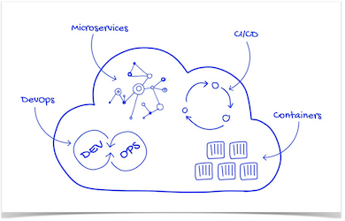
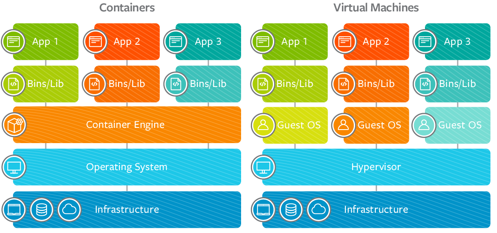
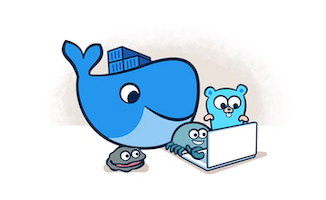

<br>

# Contents

<br>

- **Cloud native**
- **Container**
- **Docker architecture**
- **Docker objects**
- **Images and Layers**
- **Container and Layers**

---

## Cloud Native

  

#### [ Cloud Native 의 정의 ]
> **클라우드 네이티브** 기술은 조직이 퍼블릭, 프라이빗, 그리고 하이브리드 클라우드와 같은
현대적이고 동적인 환경에서 **확장 가능**한 애플리케이션을 개발하고 실행할 수 있게 해준다.
**컨테이너**, 서비스 메쉬, **마이크로서비스**, 불변(Immutable) 인프라, 그리고
**선언형(Declarative) API**가 이러한 접근 방식의 예시들이다.  
이 기술은 회복성, 관리 편의성, 가시성을 갖춘 **느슨하게 결합된** 시스템을 가능하게 한다.  
견고한 **자동화** 기능을 함께 사용하면, 엔지니어는 영향이 큰 변경을 최소한의 노력으로
자주, 예측 가능하게 수행할 수 있다.  
...

---

## Cloud Native


---

## Container

**컨테이너**는 애플리케이션이 다양한 컴퓨팅 환경에서 빠르고 안정적으로 실행될 수 있도록 **코드**와 모든 **종속성**을 **패키징**하는 소프트웨어의 표준 단위입니다.
**컨테이너**는 **가상화** 기술의 하나로 Host머신 또는 다른 컨테이너와 **분리된 환경**에서 애플리케이션을 실행시킵니다.
컨테이너는 **소형**이며 **빠르고** **이식성**이 뛰어납니다.

<br>


---

## Container vs Virtual machine



여러개의 **컨테이너**가 동일 시스템에서 실행될 수 있고, OS 커널을 공유하며, 각각은 격리된 프로세스로 실행됩니다.

**가상머신-VM**은 하드웨어 추상화 입니다.
하이퍼바이저를 이용하여 단일 시스템에서 여러개의 VM을 실행할 수 있습니다.
각 VM에는 OS, 애플리케이션, 필요한 바이너리 및 라이브러리가 모두 포함됩니다.

---

## Container vs Virtual machine

컨테이너와 가상머신을 비교하자면 다음과 같습니다.

| | Container | Virtal Machine |
| :--- | :----: | :----: |
| Virtualization | OS Virtualization | H/W Virtualization |
| Efficiency<br>(Resource usage) | O | △ |
| Performance |  O | △ |
| Provisioning |  O | △ |
| Isolation<br>(Security) | △ | O |


- **Continaer** : 성능, 실행속도, 자원활용 측면에서 장점을 가짐.  
- **Virtual Machine** : 다양한 환경(OS), 격리(보안) 측면에서 장점을 가짐.

<br><br><br><br><br><br>

[What is a container?](https://www.docker.com/resources/what-container/) [Windows container](https://docs.microsoft.com/ko-kr/virtualization/windowscontainers/about/)  

---

## Linux Container (LXC)
**Container는 Linux 커널의 여러 기능을 활용하여 격리된 공간 안에서 프로세스가 동작하도록 하는 기술입니다.**

가상머신(VM)과 같이 격리된 실행환경을 제공하지만, 컨테이너는 호스트 OS의 커널을 공유하고 프로세스의 격리환경을 제공하여 가상머신에 비해 빠른 실행속도를 보입니다.

Docker는 이러한 컨테이너를 위한 플랫폼(또는 런타임)입니다. 

<br>


---
## Linux Container (LXC)
Linux커널의 다음 요소들을 이용하여 컨테이너를 위한 격리된 환경을 제공합니다.

### Namespaces
Docker는 Linux의 아래와 같은  `namespaces` 기능을 활용하여 격리된 Container를 구현합니다
- **The pid namespace:** Process isolation (PID: Process ID).
- **The net namespace:** Managing network interfaces (NET: Networking).
- **The ipc namespace:** Managing access to IPC resources (IPC: InterProcess Communication).
- **The mnt namespace:** Managing filesystem mount points (MNT: Mount).
- **The uts namespace:** Isolating kernel and version identifiers. (UTS: Unix Timesharing System).

### Control groups
Docker Engine cgroups 이라는 Linux기술을 이용하여 CPU, Memory와 같은
Container에서 사용하는 하드웨어 리소스를 제어합니다.

### Union file systems
Union file systems은 Layer를 생성하여 동작하는 파일시스템으로 매우 가볍고 빠릅니다.
Docker는 UnionFS를 사용하여 Container에 대한 Building Block을 제공합니다.

---

## Docker

"**Docker**는 애플리케이션을 **컨테이너** 형태로 **개발**하고, **전달/배포**하고, **실행**하기 위한 **오픈 플랫폼**입니다."

**Docker**는 **컨테이너**라고 하는 느슨하게 격리된(loosely isolated) 환경에서 애플리케이션을 패키징하고 실행할 수 있는 기능을 제공합니다. 격리 및 보안을 통해 주어진 호스트에서 **많은 컨테이너를 동시에 실행**할 수 있습니다. 컨테이너는 **가볍고** 애플리케이션을 실행하는 데 필요한 **모든 것을 포함**하므로, 현재 호스트에 설치된 것에 의존할 필요가 없습니다. 컨테이너는 **쉽게 공유**될 수 있으며 공유하는 모든 사람이 동일한 방식으로 작동하는 **동일한 컨테이너**를 갖게 됩니다.

**Docker**는 컨테이너의 수명 주기를 관리하기 위한 **도구**와 **플랫폼**을 제공합니다.

[](https://www.docker.com/)[](https://www.docker.com/)[](https://www.docker.com/)

<br><br>

 **Hands-on :** 01_Docker_Intro

---

## Docker Installation

**Docker Desktop**은 컨테이너화된 애플리케이션을 구축하고 공유할 수 있는 Mac 또는 Windows 환경용으로 설치하기 쉬운 애플리케이션입니다. Docker Desktop에는 Docker Engine, Docker CLI Client, Docker Compose, Docker Content Trust, Kubernetes 및 Credential Helper가 포함 됩니다.

- `Commercial use of Docker Desktop in larger enterprises (more than 250 employees OR more than $10 million USD in annual revenue) now requires a paid subscription.`  

<br>

### DESKTOP

| Platform | x86_64 / amd64 | arm64 (Apple Silicon) |
| :--- | :---: | :---: |
| Docker Desktop for Linux |  | |
| Docker Desktop for Mac (macOS) |  |  |
| Docker Desktop for Windows |  | |

- `Mac, Windows의 경우 Linux가 실행될 VM이 필요함.`

---

## Docker Installation

**Docker Engine**은 Client-Server 애플리케이션으로 작동하는 오픈소스 패키지 입니다.
패키지는 Daemon(dockerd), CLI Client, API 를 포함하고 있습니다.

<br>

### SERVER
| Platform | x86_64 / amd64 | arm64 / aarch64 | arm (32-bit) | s390x |
| :--- | :---: | :---: | :---: | :---: |
| CentOS |  |  | | |
| Debian |  |  |  | |
| Fedora |  |  | | |
| Raspbian | | |  | |
| RHEL |  |  |  |  |
| SLES |  |  |  |  |
| Ubuntu |  |  |  |  |
| Binaries |  |  |  | |

<br>

[Install Docker Engine](https://docs.docker.com/engine/install/)

---

## Docker architecture
**Docker daemon**은 컨테이너를 **빌드/실행**하는 작업을 수행하고, **Docker client**는 이 Docker daemon과 통신합니다. (REST API를 사용)  
Docker client와 daemon은 동일한 시스템상에 존재할 수도 있고, 원격지에서 사용될 수도 있습니다.


<br>

[Docker architecture](https://docs.docker.com/get-started/overview/#docker-architecture)

---

## Docker architecture

<br>

### The Docker daemon
Docker daemon(`dockerd`)은 Docker API 요청을 받아 Docker Object(Container, Network, Volume 등)를 관리(생성/수정/삭제)합니다.

<br>

### The Docker client
Docker client(`docker`)는 Docker 유저와 상호 작용하는 주요 사용자 인터페이스입니다. 사용자가 `docker run` 과 같은 명령어를 사용하면 Docker Client는 이 명령어를 `dockerd`로 전송하는 역할을 수행합니다. 이 때 Docker 의 API가 사용됩니다.  

<br>

### Docker registries
A Docker **registry**는 Docker image들을 저장하는 저장공간입니다.  
(마치 소스코드를 Github에 저장하듯이)  
`docker pull` 이나 `docker run`과 같은 명령어를 사용하면 필요한 컨테이너 이미지를 registry에서 다운로드(`pull`)하게 됩니다.  
Docker registry는 Docker Hub(Default registry)와 같은 Public registry와 팀이나 기업내에서 자체 구축할 수 있는 Private registry로 구분될 수 있습니다.

---

## Docker objects
Docker를 사용하면 image, container, network, volume 과 같은 다양한 Docker object를 만들게 됩니다.

### Images
**Image**는 Docker 컨테이너 생성방법(instructions)이 포함된 읽기전용 템플릿입니다.  
주로 다른 Image를 기반(Base)으로 해서 추가적인 변경사항을 반영하여 만들어집니다.  
- 예) `My(new) image = Base image(Ubuntu) + Apache web server + config.`

Image는 Dockerfile을 이용하여 만들어진 이미지 또는 Registry에 게시(publish)된 이미지를 사용할 수 있습니다. 그리고, Image는 Layer라는 개념을 적용하여 자원을 효율적으로 사용합니다.

<br>

### Containers
**Container**는 **Image**를 실행하여 생성 된 **인스턴스**이며, Docker API 또는 CLI를 사용하여 생성/시작/중지/이동/삭제할 수 있습니다.  
기본적으로 컨테이너는 다른 컨테이너 및 호스트 시스템과 비교적 잘 **격리**되어 있습니다.  
Container는 Image와 생성 시 제공된 구성옵션으로 정의됩니다.  
그리고, Container가 제거될 때는 **별도의 저장공간**(**Persistent storage**)에 따로 저장하지 않은 변경사항은 모두 사라지게 됩니다.

<br><br>

[Docker objects](https://docs.docker.com/get-started/overview/#docker-objects)

---

## Images and Layers
Docker **image**는 일련의 계층(**Layer**)으로 이루어져 있으며, 이 계층들은 단일 이미지로 결합됩니다.
여기서 계층(Layer)이란 애플리케이션을 구동하기위한 *runtime*, *lib*, *src*등으로 구성된 파일시스템으로 아래 dockerfile에서 `FROM`, `COPY`, `RUN` 명령어가 실행될 때마다 각각의 Layer가 추가됩니다.

```dockerfile
FROM ubuntu:15.04
LABEL org.opencontainers.image.authors="org@example.com"
COPY . /app
RUN make /app
RUN rm -r $HOME/.cache
CMD python /app/app.py
```
|  |  |
| --- | :---: |
|  | `Container layer(Thin R/W layer)`<br>+<br>`Image layers(R/O)` |

[Images and Layers](https://docs.docker.com/storage/storagedriver/#images-and-layers)

---

## Container and layers
파일시스템 측면에서 **Container**와 **Image**의 주요 차이점은 **쓰기 가능**한 최상위 레이어(**Thin R/W layer**)입니다. 새 데이터를 추가하거나 기존 데이터를 수정하는 컨테이너에 대한 모든 쓰기는 이 layer에 저장됩니다. 컨테이너가 삭제되면 쓰기 가능한 레이어도 삭제됩니다. 기본 이미지는 변경되지 않은 상태로 유지됩니다.

각 컨테이너에는 쓰기 가능한 자체 **컨테이너 레이어**가 있고 모든 변경 사항이 이 컨테이너 레이어에 저장되기 때문에, 여러 컨테이너가 동일한 기본 이미지에 대한 액세스를 공유하면서도 고유한 데이터 상태를 가질 수 있습니다.
그리고, 이렇게 공유되는 layer구조로 인해 자원을 효율적으로 사용할 수 있습니다. (저장공간, Provisioning)

 

 **Hands-on :** 02_Docker_Layers

---

## Summary

- Cloud native
    - Container (orchestration)
    - Microservice
    - DevOps
- Container vs Virtual machine
- **Docker** : 애플리케이션을 **개발**하고, **전달/배포**하고, **실행**하기 위한 **오픈 플랫폼**
- Docker architecture
    - Docker daemon : Docker objects의 관리
    - Docker client : 사용자 인터페이스
    - Docker registries : 이미지 저장소
- Docker objects
    - Images
    - Containers
    - Networks
    - Volumes
    - etc.
- Images and Layers , Container and Layers