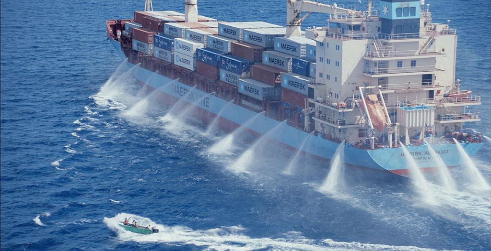
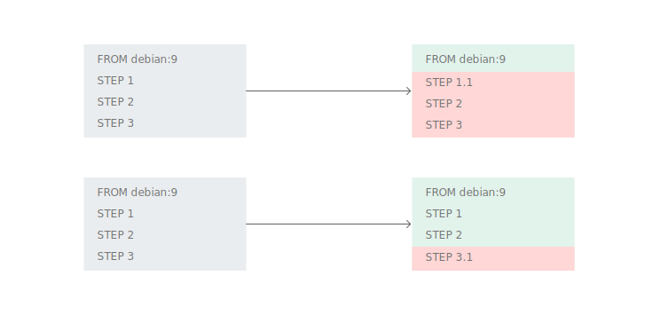

<br>

# Contents

<br>

- **Best practices for writing Dockerfiles**

---

## Best practices for writing Dockerfiles

Container 기반의 클러스터 환경에서는 컨테이너 이미지를 빌드하는 과정은 굉장히 중요한 부분입니다. 예를 들어 컨테이너 이미지가 작을 수록 클러스터에 배포되고 실행되는 시간을 단축시킬 수 있으며, 줄어든 크기만큼 클라우드 환경에서의 비용이 감소하게 됩니다. 또한 쉽게 Scale In/Out이 가능한 형태로 애플리케이션을 패키징하여 빌드가 이루어져야 될 것입니다. 여기에서는 이러한 관점에서 컨테이너 이미지를 Build하는 방법에 관한 내용을 다루고 있습니다.

<br>



<br>

[Best practices for writing Dockerfiles(Docker)](https://docs.docker.com/develop/develop-images/dockerfile_best-practices/)
[컨테이너 빌드에 대한 권장사항(Google)](https://cloud.google.com/solutions/best-practices-for-building-containers#package_a_single_application_per_container)

---

### Build context

**Build context**란 build명령어를 수행하는 디렉토리 또는 특정 위치입니다.
`docker build`명령어가 수행되면 가장먼저 build context에 존재하는 각종 실행파일, 소스코드 등을 **Docker daemon**으로 전송합니다.
그리고, Docker는 build context의 최상위 경로에 **Dockerfile**이 포함되어 있다고 가정하는데, File flag(`-f`)를 이용하면 Dockerfile의 위치를 다른 경로로 지정할 수 있습니다.

아래 예제를 통해 차이와 사용법을 알아보겠습니다.

```bash
$ mkdir myproject && cd myproject
$ echo "hello" > hello
$ echo -e "FROM busybox\nCOPY /hello /\nRUN cat /hello" > Dockerfile
$ tree
.
├── Dockerfile
└── hello
0 directories, 2 files
$ docker build -t helloapp:v1 .
```
> 이 경우는 `docker build`를 실행하는 현재 디렉토리(`.`)를 build context root로 인지합니다.

---

이제 디렉토리 구조를 조금 변경해서 보겠습니다.

```bash
$ mkdir -p dockerfiles context
$ mv Dockerfile dockerfiles && mv hello context
$ tree
.
├── context
│   └── hello
└── dockerfiles
    └── Dockerfile
2 directories, 2 files
$ docker build --no-cache -t helloapp:v2 -f dockerfiles/Dockerfile context
```
> 이 경우는 context와 dockerfile의 경로를 분리하고, `docker build` 명령어에 각각을 지정해 주었습니다.

<br>

#### Using a URL

GitLab이나 GitHub등과 같은 Git repository를 아래와 같이 Build Context로 사용할 수도 있습니다.
```
$ docker image build -t genx:1.0 git@gitlab.com:lucj/genx.git
```
이 경우 build context는 *gitlab.com/lucj/genx*안에 존재하는 파일들입니다.

---

### Exclude with .dockerignore

Build context의 폴더의 모든 파일을 docker daemon으로 전송하는데 만약 빌드하는데 불필요한 파일들(예를 들어 샘플데이터 등과 같은 테스트용 데이터나 설정파일)이 build context에 포함되어져 있다면, 그것은 그만큼 빌드에 소요되는 시간과 자원을 낭비하게 되고, `ADD`나 `COPY`명령어로 파일을 복사할때 불필요한 파일이 Container안으로 복사되어 이미지 크기가 커질 수 있습니다.

Docker에서는 이러한 상황을 방지하기 위한 방법으로 [.dockerignore](https://docs.docker.com/engine/reference/builder/#dockerignore-file)를 사용할 수 있습니다. Build context에서 파일이나 디렉토리를 제외하고 Docker daemon으로 전송하므로 필요 없는 파일을 관리할 수 있게 지원합니다.
> Git에서 [.gitignore](https://git-scm.com/docs/gitignore)와 비슷한 역할을 합니다.

`.dockerignore` file:
```
# comment
*/temp*
*/*/temp*
temp?
**/*.go
```
> `*/temp*` : root 디렉토리의 서브디렉토리들 중 temp로 시작되는 서브디렉토리 하위의 파일 및 temp로 시작되는 파일들을 제외
> `*/*/temp*` : root디렉토리의 두 레벨 아래의 서브디렉토리들 중 temp로 시작되는 서브디렉토리 하위의 파일 및 temp로 시작되는 파일들을 제외
> `temp?` : root 디렉토리 중 명칭의 길이가 4이고 temp로 시작하는 디렉토리나 파일들을 제외
> `**/*.go` : Build context의 모든 디렉토리에서 `.go`로 끝나는 모든 파일을 제외
- Go의 [filepath.Match](https://pkg.go.dev/path/filepath#Match) 규칙 참조.

---

### Use the smallest base image possible

Base 이미지는 Dockerfile의 `FROM` 명령에서 참조되는 밑바탕이 되는 이미지입니다. Dockerfile의 다른 모든 명령은 이 이미지 위에 빌드가 이루어지는데, Base 이미지가 작을수록 결과 이미지가 작아지고 다운로드 속도는 빨라집니다. 예를 들어 [alpine:3.7](https://hub.docker.com/r/library/alpine/tags/)이미지는 [centos:7](https://hub.docker.com/r/library/centos/tags/)이미지보다 **71MB** 더 작습니다.

또한 만약 애플리케이션이 Static 바이너리인 경우 자신만의 런타임 환경을 구축할 수 있는 빈 이미지인 [scratch](https://hub.docker.com/r/library/scratch/)이미지를 사용할 수도 있습니다.
```dockerfile
FROM scratch
COPY mybinary /mybinary
CMD [ "/mybinary" ]
```
구글의 [distroless](https://github.com/GoogleContainerTools/distroless) 프로젝트는 여러 언어에 최소한의 기본 이미지를 제공합니다. 이미지에는 언어에 대한 런타임 종속 항목만 포함되며, Linux 배포판에서 기대할 수 있는 많은 도구(셸, 패키지 관리자 등)는 포함되어 있지 않습니다.

Java 프로젝트인 경우, JDK 보다는 JRE를 Base image로 사용하면 컨테이너의 크기를 크게 줄일 수 있습니다. (단, 이 경우 빌드 과정은 별도로 실행해야 합니다.)

---

### Use multi-stage builds


Multi-stage build를 사용하면 중간 레이어와 파일의 수를 줄이지 않고도 최종 이미지의 크기를 크게 줄일 수 있습니다.
첫 번째 '빌드' 컨테이너에서 앱을 빌드하고 동일한 Dockerfile을 사용하면서 다른 컨테이너에서 결과를 사용할 수 있습니다.

```dockerfile
# 1-Build stage
FROM golang:1.10 as builder
WORKDIR /tmp/go
COPY hello.go ./
RUN CGO_ENABLED=0 go build -a -ldflags '-s' -o hello

# 2-Production stage
FROM scratch
CMD [ "/hello" ]
COPY --from=builder /tmp/go/hello /hello
```
> 두 번째 Stage는 [Scratch](https://hub.docker.com/_/scratch)를 base로 하고, 첫 번째 Stage의 빌드 결과물(hello binary)만 포함시킴.

---

### Don't install unnecessary packages

복잡성, 종속성, 파일 크기 및 빌드 시간을 줄이려면 "있으면 좋다"는 이유만으로 추가 또는 불필요한 패키지를 설치하지 마십시오. 예를 들어 데이터베이스 이미지에 텍스트 편집기를 포함할 필요가 없습니다.
또한, 보안의 측면에서도 과도한 권한을 가진 로컬 디버깅툴과 같은 것들을 제외하는 것이 좋습니다.

### Decouple applications


하나의 컨테이너에는 하나의 애플리케이션만 탑재하는 것이 좋습니다.
여러 개의 애플리케이션이 있는 경우보다 보다 쉽고 간단하게 Scale Out이 가능하고, 컨테이너 재사용이 용이하기 때문입니다.
예를 들어, 하나의 컨테이너에 여러 개의 앱이 있는 경우, 각 앱들은 수명 주기가 다를 수 있고 다른 상태일 수도 있습니다. 예를들어 컨테이너는 실행 중이지만 여러개의 애플리케이션 중 하나가 다운되거나 응답하지 않는 상황이 생길 수 있습니다. 이러한 경우 만약 컨테이너를 재시작해야 한다면 시스템의 서비스의 중단 등과 같은 중대한 문제가 발생할 수도 있습니다.

---

### multi-line arguments , reducing clutter
이미지의 크기를 줄이려면 이미지 내부에 꼭 필요한 부분만 설치해야합니다. 추가 패키지를 설치했다가 나중에 패키지를 제거할 수도 있지만 이러한 방법으로는 충분하지 않습니다. Dockerfile의 각 명령이 하나의 레이어를 생성하므로, 이미지를 만든 단계보다 나중의 단계에서 이미지의 데이터를 제거해도 전체 이미지의 크기는 줄어들지 않습니다. 데이터가 더 깊은 레이어에 숨겨질 뿐 여전히 존재합니다.

> `[buildpackage]` 와 `/var/lib/apt/lists/*` 파일들은 최종 결과물에는 필요없는 것들입니다.
왼쪽(Bad Dockerfile)의 경우 컨테이너에 포함되는 첫 번째 RUN layer에 이 파일들이 존재합니다.
오른쪽(Good Dockerfile)의 경우는 불필요한 파일들을 제외한 작은 사이즈의 layer만 존재합니다.

---

### Leverage build cache

이미지를 Build할때 Docker는 Dockerfile에 있는 Step에 따라 Build를 수행하는데, 이때 캐시된 Layer가 존재하면 기본설정으로 캐시에서 Layer를 찾아 재사용합니다. (캐시를 Disable하려면  `--no-cache=true` 옵션을 사용함.) 

Docker의 캐시사용 규칙은 다음과 같습니다.

- 대부분의 지시자들은 지시자 명령어 문자열이 일치하는지 여부로 캐시 사용여부를 판단합니다.
- `ADD` 과 `COPY` 지시자는 이미지 안의 파일들이 체크섬으로 기존 이미지의 체크섬과 비교/검사되고, 파일의 최종수정시간 및 마지막 액세스 시간은 고려되지 않습니다. 
- `ADD` 와 `COPY` 지시자 외에 다른 지시자들에서는 캐시 재사용확인을 위해 컨테이너의 파일들을 확인하지 않습니다. 예를 들어  `RUN apt-get -y update`의 경우 해당 명령어로 업데이트 된 파일들은 cache hit가 존재하는지 확인하기 위해 검사하지 않습니다.

<br>

### Optimize for the Docker build cache
Docker 빌드 캐시를 최대한 활용하려면 Dockerfile 맨 아래에 자주 변경되는 빌드 단계를 배치해야 합니다. 그렇치 않고 자주 변경되는 단계를 Dockerfile의 맨 위에 배치하면 그 하위의 Docker는 자주 변경되지 않는 다른 빌드 단계에 대해 빌드 캐시를 사용할 수 없으므로 비효율적인 상황이 발생하게 됩니다.

---

이러한 이유때문에 소스 코드를 복사하는 Step은 Dockerfile에서 가능한 한 늦게 배치하는 것이 좋습니다. 예를 들어 아래 그림에서  `STEP 1`을 변경하면 Docker는 `FROM debian:9` 단계의 레이어만 다시 사용하지만 `STEP 3`를 변경하면 Docker는 `STEP 1` 및 `STEP 2`의 레이어를 다시 사용할 수 있습니다. ( - 녹색부분은 재사용되는 부분임. )


Docker Build Step이 로컬 파일 시스템에 저장된 모든 종류의 캐시에 의존하는 경우, 이 캐시는 동일한 Build Step에서 수행되어야 합니다. (`apt-get update` 는 캐시를 사용하지 않아야 함.)
```dockerfile
# Bad Dockerfile
FROM debian:9
RUN apt-get update
RUN apt-get install -y nginx

# Good Dockerfile
FROM debian:9
RUN apt-get update && \
    apt-get install -y nginx
```

---
 ### Properly tag your images

 컨테이너 이미지는 하나의 소프트웨어를 패키징하고 출시하는 방법입니다. 이미지를 태그하면 사용자가 소프트웨어의 특정 버전을 식별하여 다운로드할 수 있으므로 컨테이너 이미지의 태그 정책과 소프트웨어의 출시 정책을 긴밀하게 연결해야 합니다.
> Docker 이미지는 일반적으로 이름(name)과 태그(tag)라는 2가지 구성요소로 식별됩니다. 
> 예를 들어 `google/cloud-sdk:193.0.0` 이미지의 경우, `google/cloud-sdk`는 이름(name)이고 `193.0.0`은 태그(tag)입니다. 

<br>

여기서는 Docker Container를 Tag하는 일반적인 두 가지 방법(SemVer, Git commit hash)에 대해 살펴봅니다.

##### *SemVer*(Semantic Versioning)를 사용하여 태그하기
오픈소스 및 솔루션 등과 같은 소프트웨어를 배포하는 일반적인 방법은 배포되는 애플리케이션을 '태그'(예: `git tag` 명령어)하는 것입니다. [*SemVer*(Semantic Versioning)](https://semver.org/)을 사용하면 버전 관리를 용이하게 할 수 있으며, Tag를 세 부분(X,Y,Z)으로 구성/관리하게 됩니다.
- X는 이전 버전과 호환되지 않는 API 변경에 대해서만 증가되는 **Major** 버전입니다.
- Y는 새로운 기능을 위해 증가되는 **Minor** 버전입니다.
- Z는 버그 수정을 위해 증가되는 **Patch** 버전입니다.

---

##### Git commit hash를 사용하여 태그하기
오픈소스 및 솔루션과 같은 경우 사용자들을 위해 명시적인 Tag가 필요하겠지만 그렇지 않은 경우 Git 커밋해시를 사용하는 것도 Tag에 소스추적성을 갖출 수 있어 좋은 선택일 수 있습니다. 

CI/CD 배포 자동화 시스템을 사용중이고, 애플리케이션의 배포가 자주 이루어지는 소프트웨어의 경우 SemVer과 같은 명시적인 Tag방법은 꽤 까다롭고 번거로울 수 있습니다. 이 경우 Tag의 버전 번호를 처리하는 일반적인 방법은 Git 커밋 SHA-1 해시를 버전 번호로 사용하는 것입니다. 이렇게 하면 편의성이 증대되고 Docker 이미지로부터 소스가 추적 가능하게 되는 이점을  가질수 있습니다.

git 해시값은 git rev-parse-short명령으로 알수 있습니다.

---

### Avoid running as root
기본적으로 Docker 컨테이너 내의 프로세스는 호스트 머신에 액세스할 수 없지만, 컨테이너는 호스트 머신의 커널을 공유하므로 컨테이너 격리는 Hypervisor의 가상 머신만큼 안전한 격리를 제공하지는 않습니다. 
따라서 해커 등의 공격자가 컨테이너 밖으로 나갈 수 있는 취약점을 발견한다면, 컨테이너 내에서 프로세스가 루트로 실행 중인 경우 공격자는 호스트 머신에 대한 루트 액세스 권한을 얻을 수도 있습니다.


이 가능성을 피하기 위한 권장사항은 컨테이너 내에서 루트로 프로세스를 실행하지 않는 것입니다.
Dockerfile에서 User를 생성하고 최소한의 권한을 부여하고 `USER` 지시자로 Container를 실행해야 합니다.
- 유저 및 유저그룹 생성
- 최소한의 권한부여
- USER 지시자로 실행 USER 변경

 **Hands-on :** 06_Dockerfile

---

## Summary

- Build context
- Exclude with .dockerignore
- Use the smallest base image possible
- Use multi-stage builds
- Don't install unnecessary packages
- Decouple applications
- multi-line arguments , reducing clutter
- Leverage build cache
- Optimize for the Docker build cache
- Properly tag your images
- Avoid running as root

<br><br><br><br><br>

`문의처` : 정상업 / rogallo.jung@samsung.com