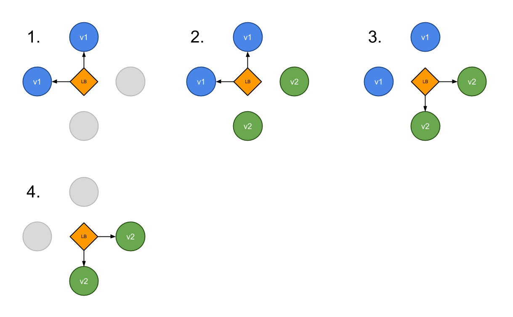

# Contents


<br>

- **Deployment strategies**
  - **Recreate**
  - **RollingUpdate**
  - **Blue/Green deployments**
  - **Canary deployments**

---

## Deployment strategies

Kubernetes 환경에서 애플리케이션을 배포하는 방법은 여러가지가 있습니다.
이번 장에서는 여러가지 배포전략의 특징을 알아보겠습니다.


[Kubernetes deployment strategies](https://blog.container-solutions.com/kubernetes-deployment-strategies)
[Kubernetes deployment strategies(Github)](https://github.com/ContainerSolutions/k8s-deployment-strategies)

---

### Recreate

**Recreate**전략은 기존 Version A를 제거하고 Version B를 배포하는 전략으로 Cloud환경에서 비용이 적게 들고 간편한 설정으로 인해 개발환경에서 선택할 수 있는 좋은 전략입니다.  **Recreate**은 Deployment 의 `.spec.strategy`를 아래와 같이 지정하여 사용할 수 있습니다.

```yaml
spec:
  strategy:
    type: Recreate
```

다만 이러한 Recreate전략은 기존 A버전의 애플리케이션이 중단되면 대체할 수 있는 애플리케이션이 없기 때문에 B버전의 애플리케이션이 시작되기까지 **Downtime**이 발생하게 됩니다.


---

### RollingUpdate(Ramped)

**Rolling Update**는 Kubernetes에서 쉽고 효율적으로 사용 할 수 있는 **무중단 배포전략**으로, Pod를 순차 update하는 방식입니다. 이러한 배포방법은 자원을 효율적으로 사용하면서 전체 서비스가 끊김없이 지속될 수 있는 효과를 볼 수 있습니다. **RollingUpdate**는 Deployment 의 `.spec.strategy`를 아래와 같이 지정하여 사용할 수 있습니다.

```yaml
spec:
  strategy:
    type: Recreate
    rollingUpdate:
      maxSurge: 1
      maxUnavailable: 0
```


---

### RollingUpdate(Ramped)

RollingUpdate 진행중의 과정을 그림으로 표현하면 아래와 같습니다.
v1 pod들이 정해진 범위 내에서(maxSurge, maxUnavailable) v2 pod로 대체되게 됩니다.
진행 중에 일시적으로 다른 버젼이 서비스되기는 하지만, 서비스 중단없이 업데이트를 수행하는 가장 손쉬운 방법입니다.


---

### Blue/Green deployments

**Blue/green deployment**는 Blue(Old version)와 Green(New version)이 모두 운영환경에 존재하는 상태에서 Green(New version)을 테스트한 후 문제가 없으면 트래픽을 Blue에서 Green으로 전환하는 전략입니다.
이 전략은 업데이트와 롤백을 중단없이 할 수 있다는 장점이 있는 반면, 배포시 두 배의 리소스가 소요된다는 점과 Stateful한 애플리케이션의 경우는 핸들링하기가 어렵다는 단점이 있습니다.



---


### Canary deployments

**Canary deployment**는 운영환경에서 V1로 배포된 애플리케이션을 V2로 점진적으로 트래픽을 이동시키는 방법입니다. 예를 들어 동일한 애플리케이션에 대한 사용자 요청을 90%는 V1로 나머지 10%를 새롭게 배포된 V2로 보내는 전략입니다. 이러한 배포방법은 배포할 애플리케이션에 대한 테스트가 부족하거나 안정성에 대한 확신이 없을 경우 사용할 수 있습니다.


 **Hands-on :** 10_Kubernetes_Deployment_strategies

---

## Summary

- Deployment strategies
  - Recreate
  - RollingUpdate
  - Blue/Green deployments
  - Canary deployments

<br><br><br><br><br><br><br><br><br><br><br><br>

`문의처` : 정상업 / rogallo.jung@samsung.com