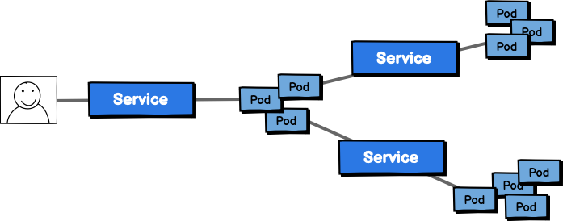
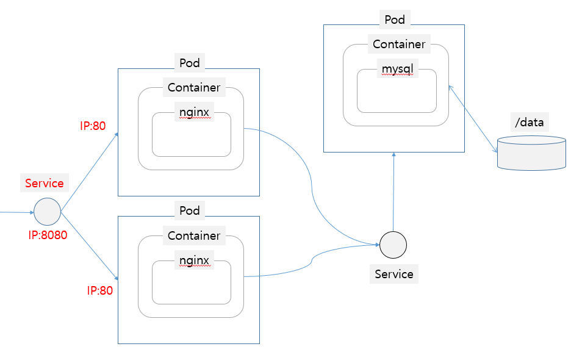
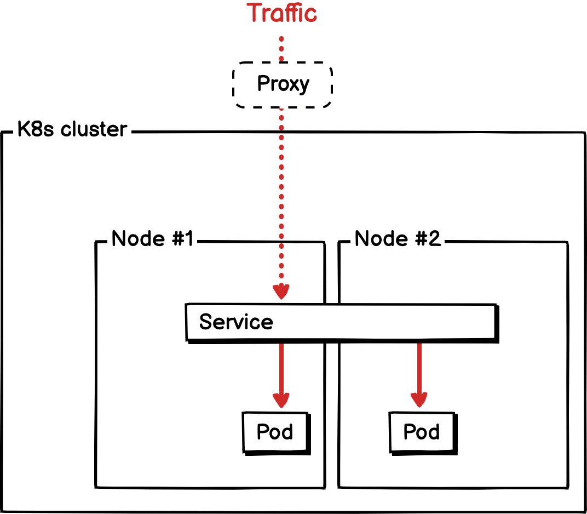
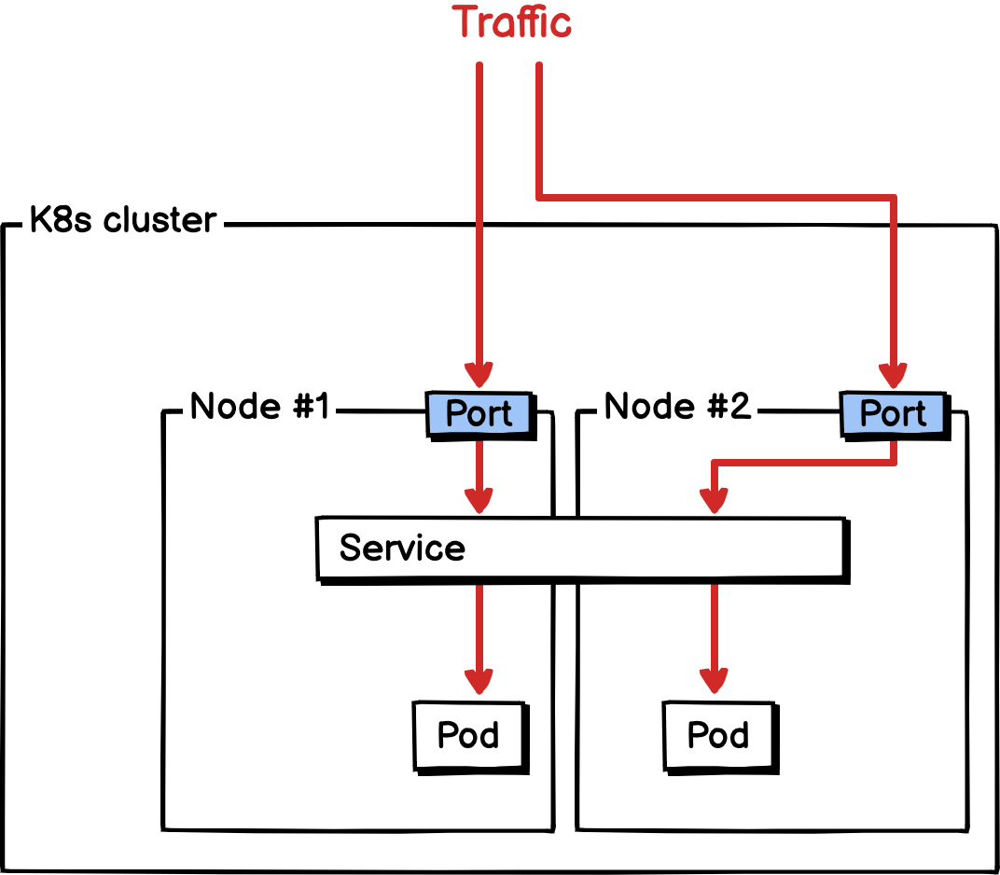
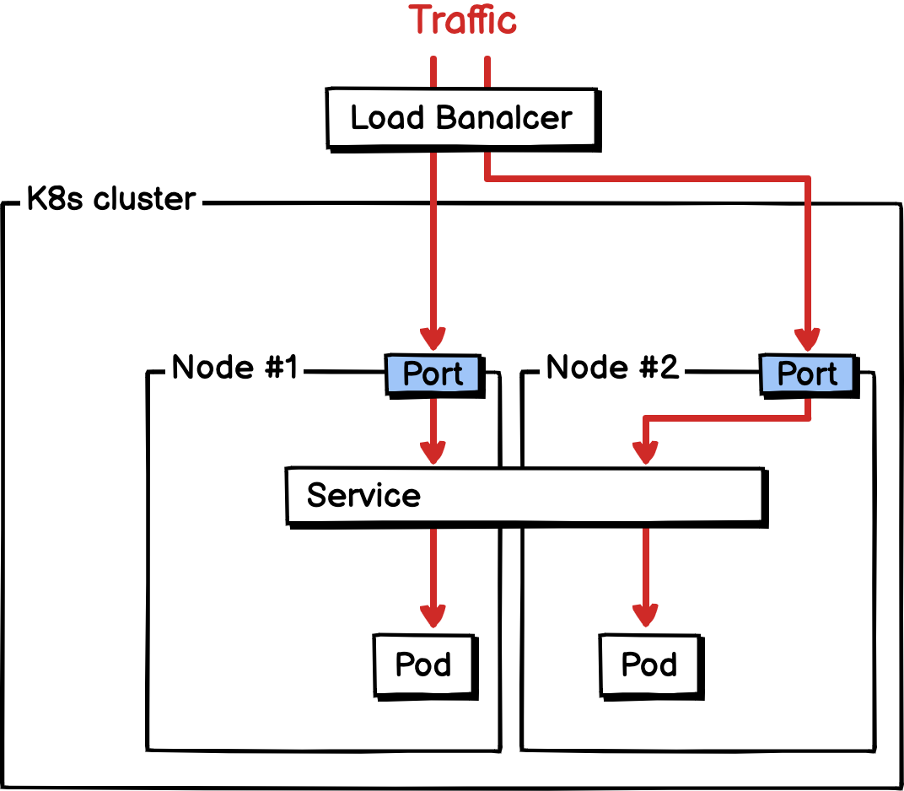
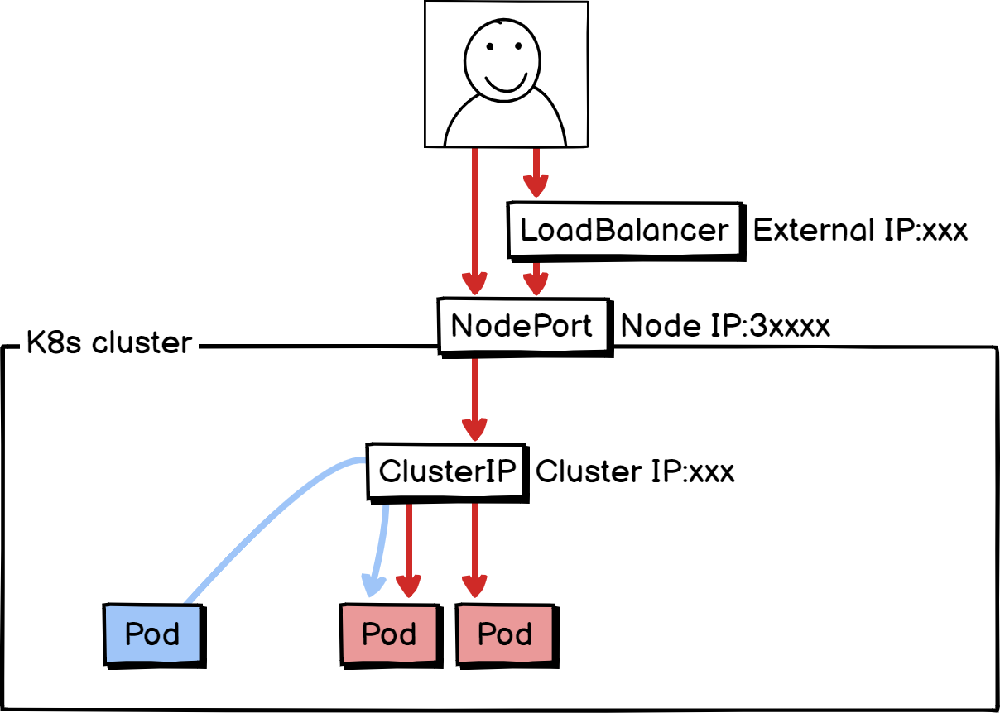
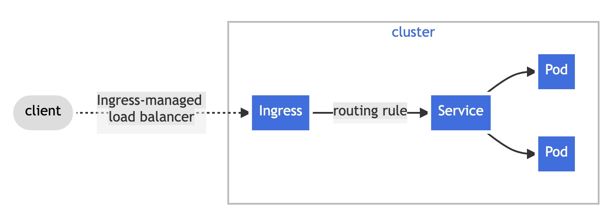

# Contents


<br>

- **Service**
- **Service의 특징**
- **Ingress**

---

## Service

**Kubernetes**에서 **Service**는 **Pod**로 실행중인 애플리케이션을 네트워크 서비스로 노출하는 추상화 방법입니다.
**Pod**는 생성되면 고유의 IP를 가지지만 수시로 생성/삭제/확장되는 환경을 감안하면, 주어진 Pod의 IP로 서비스를 이용하는것은 불가능합니다.
그래서, **Kubernetes**에서는 **Service**라는 리소스를 사용하여

- 고정된 IP
- 여러개의 Pod에 대한 Loadbalancing

을 제공합니다.

**Service**는 외부사용자나 시스템이 접근할 때도, 클러스터 내부의 Pod들 간에도
적용됩니다.



---

## Service


Pod는 ReplicaSet에 의해 동적으로 생성되고 소멸되기를 반복하기 때문에 Pod의 IP로
서비스를 할 수 없습니다. Kubenetes에서는 Pod간의 통신이 필요하다면
(e.g. Font-ent, Back-end 간 통신) Service Object를 생성하여 통신해야 합니다. 
위의 그림에서 변화하는 Object들인 Nginx와 mysql의 앞에 Service object를 두어
Pod간에 통신이 안정적으로 이루어지도록 합니다.

---

## Service

**Service** 는 아래와 같이 정의합니다.

```yaml
apiVersion: v1
kind: Service
metadata:
  name: my-service
spec:
  type: ClusterIP
  selector:
    app: MyApp
  ports:
    - protocol: TCP
      port: 80
      targetPort: 9376
```

위의 Service object는 각각 아래와 같은 특징을 가지고 있습니다.

- `.metadata.name` = my-service : 이름은 "my-service"
- `.spec.type` = ClusterIP : ClusterIP 유형의 서비스
- `.spec.selector` = `app: MyApp` : 연결된 Pod를 결정하는 selector (app=MyApp 레이블을 가진 Pod를 연결)
- `.spec.ports.port` = 80 : 클러스터에 노출되는 Port는 80
- `.spec.ports.targetPort` = 9376 : Target pod의 Port는 9376

---

## Service 의 특징

##### Service의 종류 (Type)

| Service type                |                                         | Description                                           |
|:--------------------------- |:---------------------------------------:|:----------------------------------------------------- |
| ClusterIP<br>(Default type) |  | 서비스를 클러스터-내부 IP에 노출시킴.<br> (클러스터 내에서만 서비스에 도달할 수 있음.) |

> ClusterIP는 클러스터 **내부에서만 접근 가능**한 IP가 주어지기 때문에 외부에서 접근하기 위해서는 추가적인 방법을 적용해야 합니다.
> [kubectl proxy](https://kubernetes.io/ko/docs/tasks/access-application-cluster/access-cluster/#kubectl-proxy-%EC%82%AC%EC%9A%A9)명령을 이용하여 localhost와 api서버간에 proxy를 구성하거나, 뒤에 배울 ingress 리소스를 이용하여 외부에서 접속할 수 있습니다.

---

## Service 의 특징

##### Service의 종류 (Type)

| Service type |                                            | Description                                                                |
|:------------ |:------------------------------------------:|:-------------------------------------------------------------------------- |
| NodePort     |      | 고정 포트(NodePort)로 각 노드의 IP에 서비스를 노출시킴.<br> (외부에서 [NodeIP]:[NodePort]로 접근가능) |
| LoadBalancer |  | 클라우드 공급자의 로드 밸런서를 사용하여 서비스를 외부에 노출시킴.                                      |

---

## Service 의 특징

##### Service의 종류 (Type)

위의 타입별 특징을 한 장의 그림으로 표현하면 다음과 같습니다.
<br>


---

## Service 의 특징

##### Labels and Selectors

Service가 연결할 Target Pods를 지정하기 위해 Label과 Selector를 사용합니다.
Service의 `.spec.selector`에 지정된 Label 규칙에 해당하는 Pod를 Target으로 연결합니다.

<br>


> Label은 Object 생성시점 또는 생성 이후에도 추가할 수 있습니다.

---

## Service 의 특징

##### Labels and Selectors

Label과 Selector를 사용하는 예제입니다.

```yaml
apiVersion: apps/v1
kind: Deployment
metadata:
  name: nginx-deployment
  labels:
    app: my-nginx
    tier: frontend
spec:
  replicas: 2
  selector:
    matchLabels:
      app: my-nginx
  template:
    metadata:
      labels:
        app: my-nginx
      name: my-nginx
    spec:
      containers:
      - image: nginx:1.19.3
        name: my-nginx
        ports:
        - containerPort: 80
```

> label : `app: my-nginx`

---

## Service 의 특징

##### Labels and Selectors

```yaml
apiVersion: v1
kind: Service
metadata:
  name: nginx-clusterip-service
spec:
  type: ClusterIP
  selector:
    app: my-nginx
  ports:
    - protocol: TCP
      port: 80
      targetPort: 80
```

> selector : `app: my-nginx`

Service측에서 설정한 Selector 규칙에 해당하는 Pod를 모두 선택하게 됩니다.

<br>

##### DNS

Service 의 name은 Kubernetes Cluster상에서 해당 서비스의 Hostname을 뜻하며, 이것을 바탕으로 쿠버네티스 클러스터상에 단일 DNS명을 부여합니다.

> DNS 명 생성규칙 : `<service-name>.<namespace-name>.svc.cluster.local`

---

## Ingress

Ingress는 `NodePort`, `LoadBalancer` 와 마찬가지로 애플리케이션의 Service를 외부로 노출할때 사용되는 리소스입니다.
외부에서 들어온 HTTP와 HTTPS 트래픽을 ingress resouce를 생성하여 Cluster내부의 Service로 L7영역에서 라우팅하며  로드밸런싱, TLS, 도메인 기반의 Virtual Hosting을 제공합니다.
이러한 기능은 NodePort로 서비스를 노출하는 것에 비해 외부의 서비스를 보다 손쉽게 관리할 수 있도록해줍니다.

Ingress는 실질적인 라우팅 기능을 제공하는 [Ingress Controller](https://kubernetes.io/ko/docs/concepts/services-networking/ingress-controllers/)와 [Ingress](https://kubernetes.io/ko/docs/concepts/services-networking/ingress/)
리소스로 구성할 수 있는데, ingress 리소스는 외부의 URLs을 Cluster 내부의
Service로 라우팅하는 rule이 정의되어 있으며, Ingress Controller에는
다양한 구현체가 존재하며, 대표적인 Ingress controller로 [Nginx Ingress Controller](https://kubernetes.github.io/ingress-nginx/)가 있습니다.

> HTTP/HTTPS 외의 서비스를 노출하려면 Ingress가 아닌 다른 방법을 적용해야 합니다. (e.g. NodePort) 

---

## Summary

- Service
- Service의 특징
  - Type
    - ClusterIP
    - NodePort
    - LoadBalancer
  - Labels and Selectors
  - DNS
- Ingress
