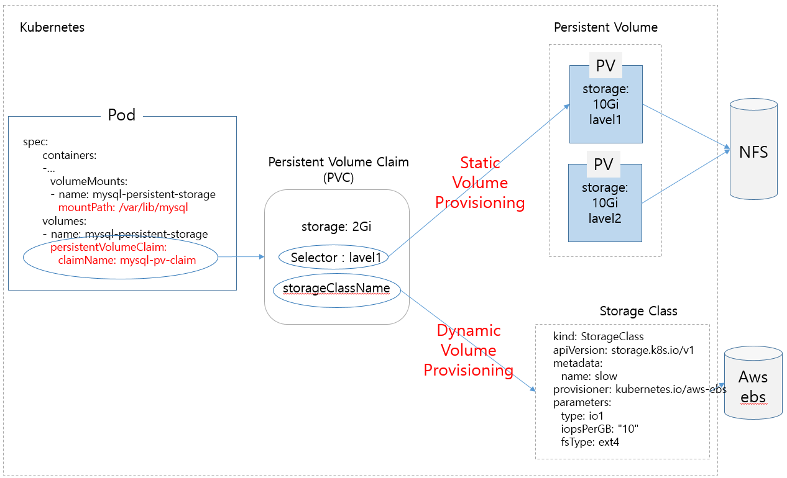

# Contents


<br>

- **Volume**
- **PersistentVolume**
- **PersistentVolumeClaim**

---

## Volume

컨테이너가 실행되고 실행 중에 상태를 가지고 데이터가 생성되어도, 컨테이너가 종료되면 컨테이너에서 생성되었던 모든 데이터는 사라집니다. 이것은 Kubernetes상에서 자유롭게 Pod를 복제하고 배포하는데 있어 커다란 장점으로 작용합니다.

하지만, 시스템 로그나 데이터베이스의 데이터 같이 애플리케이션은 종료되더라도 데이터가 유지되어야만 하는 경우도 있습니다. 이렇게 데이터의 상태를 유지할 수 있도록 사용하는 것이 **Volume**입니다.

Kubernetes에서는 Docker와는 다르게 Pod 단위로 [Volume](https://kubernetes.io/docs/concepts/storage/volumes/)을 관리하며, Life Cycle과 제공되는 디스크 Type 따라 다양한 옵션과 종류가 존재합니다.
하나의 Pod에서 여러종류의 **Volume**을 사용할 수도 있습니다.

이 장에서는 Kubernetes의 영구 Volume체계인

- PersistentVolume(PV)와 
- PersistentVolumeClaim(PVC)

에 대해 살펴보겠습니다.

---

## Volume



---

### Volume 종류

Volume은 제공되는 디스크 Type에 따라 여러가지 종류의 Volume Type을 지원합니다.

| Temp                                                                         | Local                                                                                                                                                | Network                                                                                                                                                                    |
| ---------------------------------------------------------------------------- | ---------------------------------------------------------------------------------------------------------------------------------------------------- | -------------------------------------------------------------------------------------------------------------------------------------------------------------------------- |
| [emptyDir](https://kubernetes.io/ko/docs/concepts/storage/volumes/#emptydir) | [hostPath](https://kubernetes.io/ko/docs/concepts/storage/volumes/#hostpath), [local](https://kubernetes.io/ko/docs/concepts/storage/volumes/#local) | [NFS](https://kubernetes.io/ko/docs/concepts/storage/volumes/#nfs), [awsElasticBlockStore](https://kubernetes.io/ko/docs/concepts/storage/volumes/#awselasticblockstore).. |

- **emptyDir** : 동일한 Pod내의 컨테이너들이 사용가능한 임시 Volume으로, Pod가 Node에서 삭제되면 Volume의 데이터도 같이 삭제됩니다. 이름처럼 초기 생성 시 비어있는 형태로 생성됩니다.
- **hostPath** : Pod에 호스트 노드의 파일이나 디렉토리를 마운트하여 사용하며, Pod가 삭제되어도 내용이 삭제되지 않습니다.
- **local** : 특정 노드에 mount된 파일시스템을 Volume으로 사용합니다.
- **Network** : 네트워크 또는 클라우드 상에 존재하는 storage를 Volume으로 사용합니다.

> **hostPath** 는 Host node의 파일시스템에 직접 접근하므로, 보안 측면에서 취약한 구조를 가지고 있습니다.
> 특별한 경우가 아니면 사용하지 않는것이 좋습니다.

---

### Volume Provisioning 에 따른 분류

Kubernetes에서는 자동으로 Volume을 생성할 수 있느냐 없느냐에 따라 **Static Volume Provisioning**과 **DynamicVolume Provisoning**으로 구분할 수 있습니다. 

- **Static Volume Provisioning** : **관리자**가 수동으로 Kubernetes에서 Persistent Volume을 생성.
- **Dynamic Volume Provisoning** : **개발자**의 요청에 의해 자동으로 Kubernetes에서 Persistent Volume을 생성.

**Static Volume Provisioning**은 관리자가 클러스터 내에서 사용할 수 있는 Persistent Volume(PV)들을 생성하고 세부사항을 제공하여 사용자(개발자)가 사용할 수 있도록 하는 방식입니다.
반면 **Dynamic Volume Provisoning** 는 사용자(개발자)가 필요할 때 생성 요청을 하고, 요청된 Spec에 해당하는 Persistent Volume(PV)가 생성되고 사용되는 형태입니다. 이때 **StorageClass**가 사용됩니다.

<br><br><br>

### Persistent Volume(PV) & Persistent Volume Claim(PVC)

쿠버네티스에서 볼륨을 사용하는 구조는 스토리지를 매핑시킨 PersistentVolume(PV)과 그 PV를 Pod에서 사용할때 PV로 Volume내역을 요청하는 PersistentVolumeClaim(PVC) 2단계로 분리되어 있습니다.

PVC는 **개발자** 또는 **클라우드 사용자**가 PV Volume을 할당해달라는 **요청**에 해당합니다. 사용하고 싶은 **용량**과 각종 Volume에 관한 **설정값**을 정해서 요청하게 됩니다.

---

## Persistent Volume(PV)

아래는 PersistentVolume(PV)예시입니다.

```yaml
apiVersion: v1
kind: PersistentVolume
metadata:
  name: pv0003
spec:
  capacity:
    storage: 5Gi
  volumeMode: Filesystem
  accessModes:
    - ReadWriteOnce
  persistentVolumeReclaimPolicy: Recycle
  storageClassName: slow
  mountOptions:
    - hard
    - nfsvers=4.1
  nfs:
    path: /tmp
    server: 172.17.0.2
```

> 용량, Mode, Path등의 정보가 있습니다.

---

## Persistent Volume(PV)

### Phase

Volume은 아래와 같은 단계(Phase)를 가집니다. 해당 단계는 PersistentVolume(PV)이 생성되고,
`kubectl get pv` 명령을 통해 조회할 수 있습니다.

- **Available** – PV가 생성되고 PVC가 바인딩되기 전 단계
- **Bound** – PV가 PVC에 바인딩된 단계
- **Released** – PVC가 삭제된 단계 (아직 리소스를 반환하지는 않음)
- **Failed** – 자동반환 실패

<br>

### volumeMode

- **Filesystem** (Default) - Volume 이 Pod의 디렉토리에 마운트 됨.
- **Block** - block device로 Pod에 제공됨.

---

## Persistent Volume(PV)

### Access Modes

Access 유형에 따라 다음과 같이 구분됩니다.

- **ReadWriteOnce**(**RWO**) – 단일 노드에 의한 읽기-쓰기로 볼륨이 마운트될 수 있습니다.
- **ReadOnlyMany**(**ROX**) – 여러 노드에 의한 읽기 전용으로 볼륨이 마운트될 수 있습니다.
- **ReadWriteMany**(**RWX**) – 여러 노드에 의한 읽기-쓰기로 볼륨이 마운트될 수 있습니다.
- **ReadWriteOncePod**(**RWOP**) - 볼륨이 단일 파드에서 읽기-쓰기로 마운트될 수 있습니다.

### Reclaim Policy

사용자가 볼륨을 다 사용하고나면 리소스를 반환할 수 있는 API를 사용하여 PVC 오브젝트를 삭제할 수 있습니다. 이때 PV에서 수행할 작업 유형에 따라 다음과 같은 종류가 있습니다.

- **Retain** – 리소스를 수동반환하는 방식으로, PV는 Released Phase가 되고 데이터 유지(다시 쓰기 위해서는 PV를 삭제하고 재생성해야함)
- **Recycle** – PV는 유지하고 파일만 삭제 (`rm -rf /thevolume/*`), 새로운 PVC에서 사용가능
- **Delete** – 볼륨 및 데이터 삭제

> 현재 NFS 및 HostPath만 Recycle을 지원함. AWS EBS, GCE PD, Azure Disk 및 Cinder 볼륨은 Delete를 지원함.

---

## Persistent Volume Claim(PVC)

아래는 Persistent Volume Claim(PVC) 예시입니다.

```
kind: PersistentVolumeClaim
apiVersion: v1
metadata:
  name: myclaim
spec:
  accessModes:
    - ReadWriteOnce
  volumeMode: Filesystem
  resources:
    requests:
      storage: 8Gi
  storageClassName: slow
  selector:
    matchLabels:
      release: "stable"
    matchExpressions:
      - {key: environment, operator: In, values: [dev]}
```

<br><br><br><br><br>

 **Hands-on :** 14_Kubernetes_Volume

---

## Summary

- Volume
  - Temp : emptyDir
  - Local : hostPath, local
  - Network : NFS, awsElasticBlockStore
- Static Volume Provisoning / Dynamic Volume Provisoning
- PersistentVolume
  - Phase : Available / Bound / Released / Failed
  - volumeMode : Filesystem / block
  - Access Modes : RWO / ROX / RWX / RWOP
  - Reclaim Policy : Retain / Recycle / Delete
- PersistentVolumeClaim
