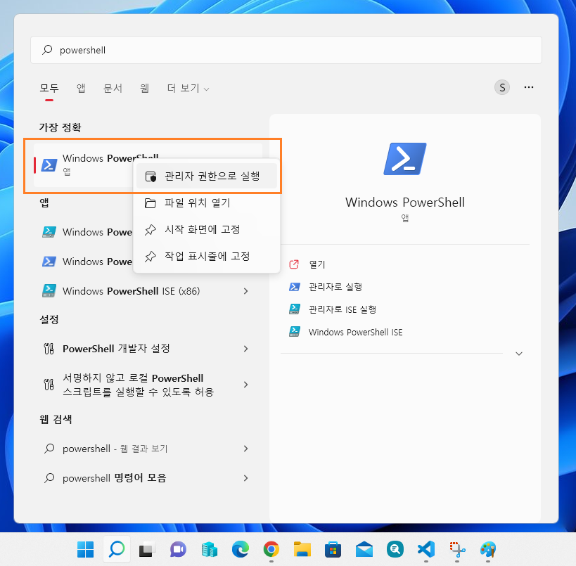
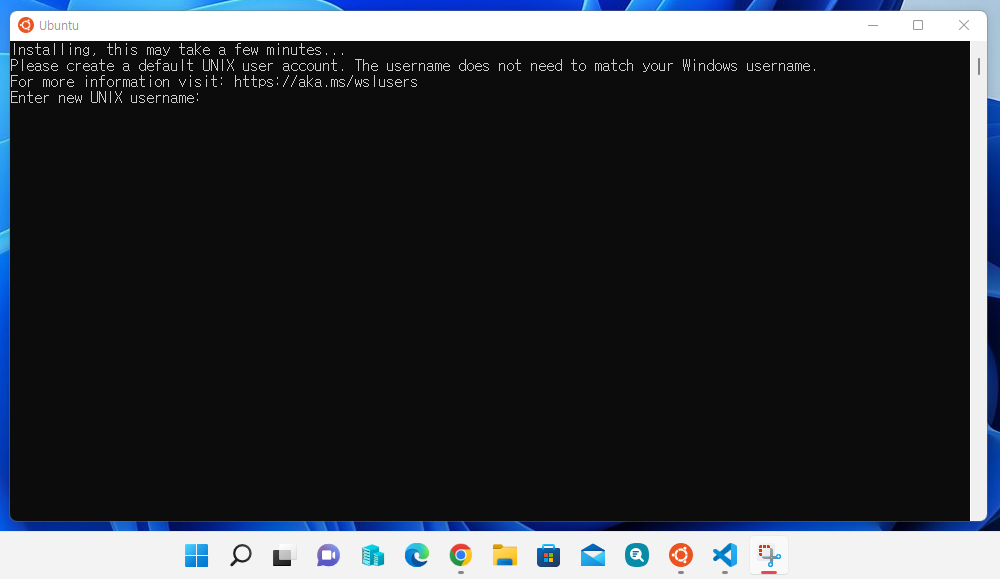
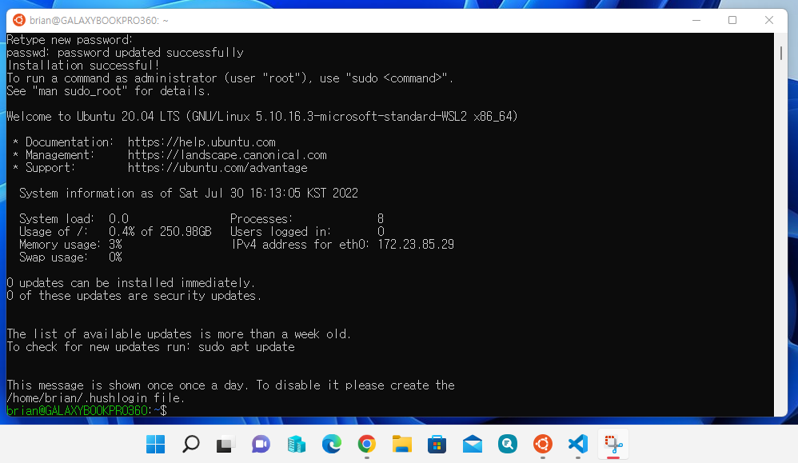
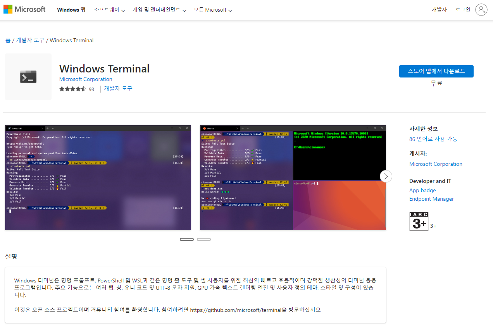
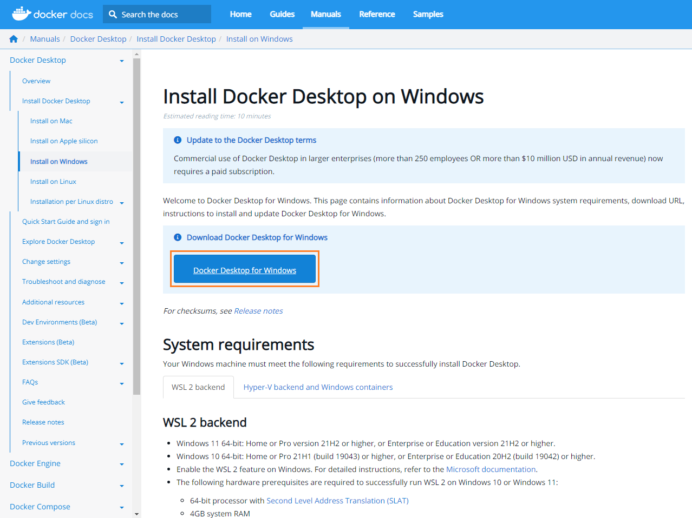
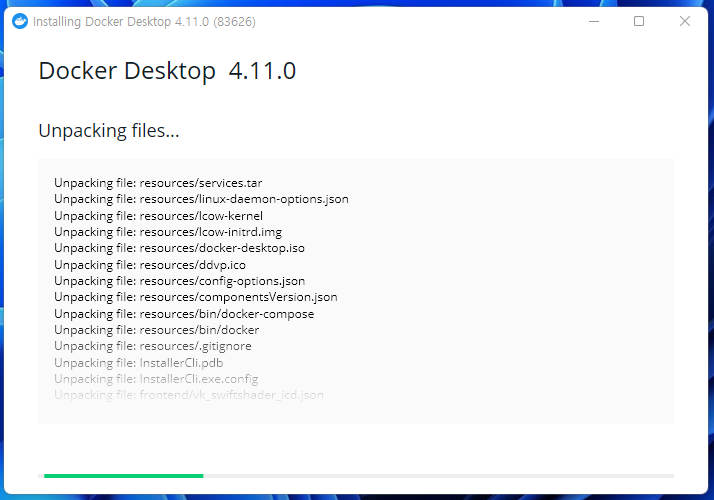
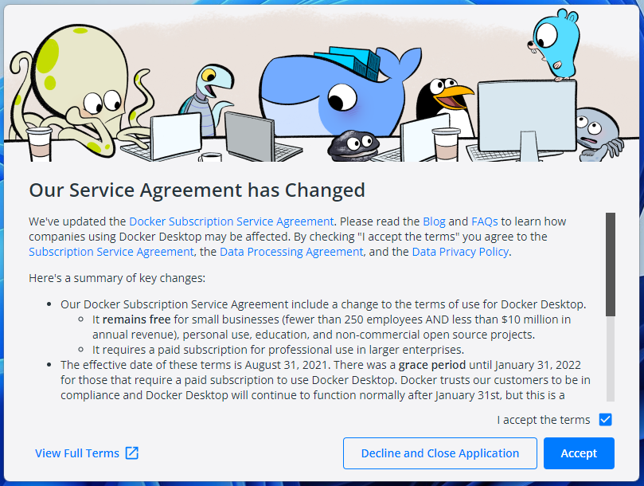
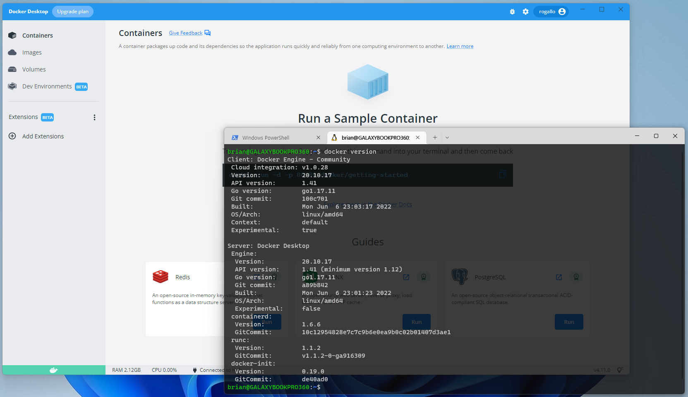
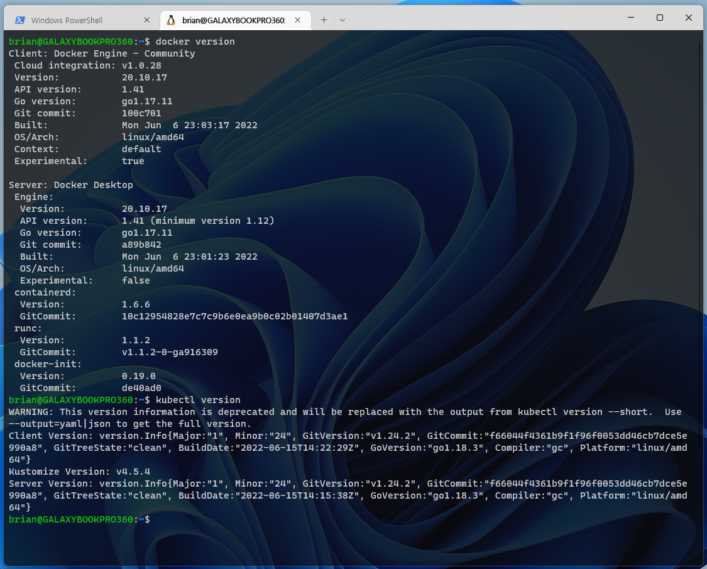

 

## [Hands-on] 00. Environment setup

 

실습을 위한 환경구성 가이드입니다.  
Windows 환경에 대한 설명이며, MacOS는 관련 문서의 Mac부분을 참조하세요.  

 

**Docker desktop on Windows (Kubernetes포함)**  
1. Linux 환경 준비 : WSL2 설치 (Ubuntu 포함)
2. Docker desktop for Windows 설치

---

### 1. Linux 환경 준비 : [WSL2](https://docs.microsoft.com/ko-kr/windows/wsl/install)
먼저 윈도우즈에 리눅스 환경을 준비합니다.  
여러가지 방법 중 WSL2를 이용해서 준비해 보겠습니다.  

PowerShell을 관리자 권한으로 실행.  

 
---

PowerShell에서 `wsl --install` 실행 
> **조건** : Windows 10 버전 2004 이상(빌드 19041 이상) 또는 Windows 11  
> 위 조건에 해당하지 않는 경우 [WSL 수동설치](https://docs.microsoft.com/ko-kr/windows/wsl/install-manual)를 참고하세요.

완료 후 시스템 재시작  

> Default 리눅스 배포판은 Ubuntu입니다.  
> 다른 배포판을 설치하려면 [설치된 기본 Linux 배포판 변경](https://docs.microsoft.com/ko-kr/windows/wsl/install#change-the-default-linux-distribution-installed)를 참조하세요.  

---

시스템 재시작 후 아래와 같은 창이 자동으로 열립니다.  
리눅스 사용자 계정과 암호를 설정합니다.  

---

  
여기까지 하면 **리눅스(Ubuntu)** 환경은 준비가 됐습니다.

---

이제 필요할 때는 아래와 같이 시작메뉴의 **Ubuntu**를 실행하면 됩니다.  

사용을 마치고 리눅스를 종료하려면 PowerShell에서 `wsl --shutdown` 명령어를 실행하면 됩니다.  

---

### [선택사항] [Windows terminal](https://docs.microsoft.com/ko-KR/windows/terminal/install)
여러가지 명령줄 도구나 Shell을 편리하게 사용하려면, 이 툴을 사용하는 것을 추천드립니다.  
하나의 툴로 PowerShell, Ubuntu shell 등을 탭으로 구분하여 실행할 수 있습니다.  

[설치](https://aka.ms/terminal) -> Microsoft store에서 설치  

---

Windows terminal에서는 아래와 같이 **Ubuntu**를 실행하면 됩니다. (v 버튼 > Ubuntu)  

종료는 PowerShell 에서 `wsl --shutdown`

---

### 2. [Docker desktop](https://docs.docker.com/desktop/install/windows-install/) 설치

> 사전조건 : WSL2 설치완료, 리눅스 배포판(e.g. Ubuntu) 설치완료  

리눅스가 준비됐으면, 이제 Docker desktop을 설치합니다.  
[설치 가이드](https://docs.docker.com/desktop/install/windows-install/)페이지에서 설치파일을 다운로드 하여 실행합니다.  

---

  
  
  
여기까지 하면 설치완료 (ง˙∇˙)ว

---

설치완료 후 처음 실행하면 아래 그림과 같은 Service agreement 페이지가 열립니다.  
확인 후 시작합니다.  

- **주의** : **Commercial use** of Docker Desktop in larger enterprises (more than 250 employees OR more than $10 million USD in annual revenue) now requires a **paid subscription**.  

---

Docker Desktop 실행 후 Windows terminal에서 아래와 같이 `docker` 명령어를 실행할 수 있습니다.  

여기까지 하면 Docker 환경은 준비가 됐습니다.  

---

설정에서 Kubernetes를 Enable로 하면 Kubernetes 실습을 해볼 수 있습니다.  (Single-node cluster)  

---

모든 설치와 설정이 정상적으로 되고나면, 아래 그림처럼
- `docker`
- `kubectl`
명령어를 실행할 수 있습니다.  

끝~~~  ＿〆(。╹‿ ╹ 。)