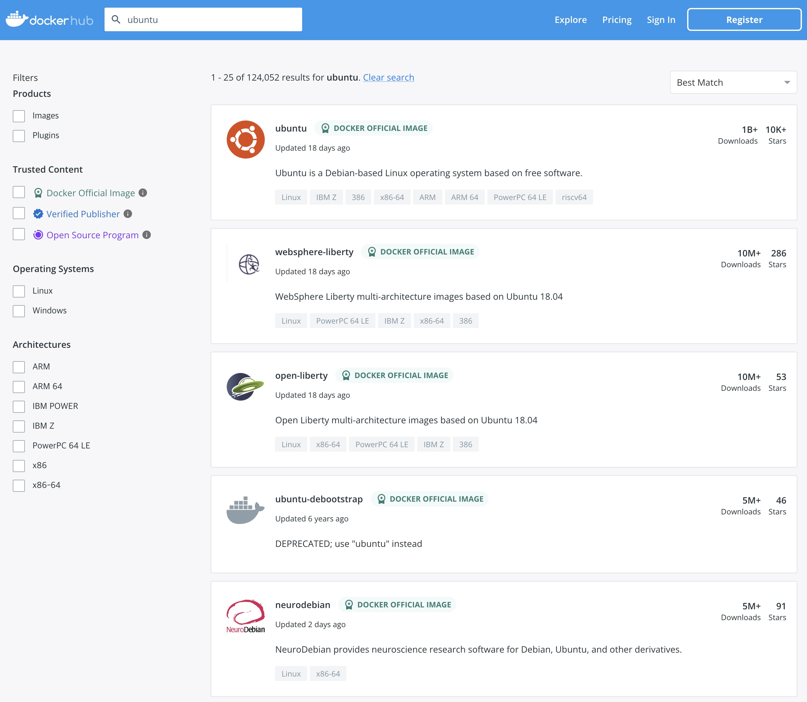
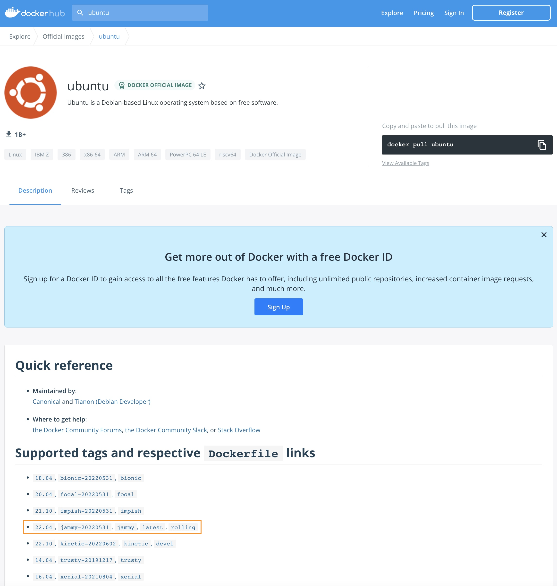

## [Hands-on] 03. Docker commands

자주 사용되는 도커 명령어를 알아보겠습니다.

​먼저 이미지를 모두 정리하고 시작할게요.

```bash
ubuntu@ip-10-0-1-14:~$ docker rmi --force $(docker images --all --quiet)
Untagged: nginx:latest
Untagged: nginx@sha256:10f14ffa93f8dedf1057897b745e5ac72ac5655c299dade0aa434c71557697ea
Deleted: sha256:55f4b40fe486a5b734b46bb7bf28f52fa31426bf23be068c8e7b19e58d9b8deb
Deleted: sha256:5f58fed9b4d8e6c09cdc42eed6de6df7a7e35b40d92c98f30f8ecad4960fb7a0
Deleted: sha256:8bb72c1d014292ebf1ae348a77624c536e766757356c6dbb0de75122a94b445d
Deleted: sha256:cc9ac0adbded956d924bcf6c26ffbc93ea070019be1437d204b530a033ff4b16
Deleted: sha256:30f210588f35917f0edb5a2465db7ad60e4ef3b6ac74fe155474e14e6f0995c5
Deleted: sha256:5ecd5431cf49a2a11115844de1e7b23b9535be8789add9ab50973867db5f7d36
Deleted: sha256:08249ce7456a1c0613eafe868aed936a284ed9f1d6144f7d2d08c514974a2af9
Untagged: busybox:latest
Untagged: busybox@sha256:3614ca5eacf0a3a1bcc361c939202a974b4902b9334ff36eb29ffe9011aaad83
Deleted: sha256:62aedd01bd8520c43d06b09f7a0f67ba9720bdc04631a8242c65ea995f3ecac8
Deleted: sha256:7ad00cd55506625f2afad262de6002c8cef20d214b353e51d1025e40e8646e18
```
> **명령어** : `docker rmi --force $(docker images --all --quiet)`

- `--force(-f)` 옵션은 강제로 삭제를 하는 옵션이니 주의해서 사용해야 합니다.

---

도커이미지를 검색하는 명령어는 `docker search`입니다.
도커허브에서 Ubuntu 이미지를 찾아볼까요?  
```bash
ubuntu@ip-10-0-1-14:~$ docker search ubuntu
NAME                             DESCRIPTION                                     STARS     OFFICIAL   AUTOMATED
ubuntu                           Ubuntu is a Debian-based Linux operating sys…   14486     [OK]
websphere-liberty                WebSphere Liberty multi-architecture images …   286       [OK]
ubuntu-upstart                   DEPRECATED, as is Upstart (find other proces…   112       [OK]
neurodebian                      NeuroDebian provides neuroscience research s…   91        [OK]
open-liberty                     Open Liberty multi-architecture images based…   53        [OK]
ubuntu/nginx                     Nginx, a high-performance reverse proxy & we…   52
ubuntu-debootstrap               DEPRECATED; use "ubuntu" instead                46        [OK]
ubuntu/apache2                   Apache, a secure & extensible open-source HT…   36
ubuntu/mysql                     MySQL open source fast, stable, multi-thread…   34
kasmweb/ubuntu-bionic-desktop    Ubuntu productivity desktop for Kasm Workspa…   29
ubuntu/prometheus                Prometheus is a systems and service monitori…   27
ubuntu/squid                     Squid is a caching proxy for the Web. Long-t…   25
ubuntu/bind9                     BIND 9 is a very flexible, full-featured DNS…   21
ubuntu/postgres                  PostgreSQL is an open source object-relation…   17
ubuntu/redis                     Redis, an open source key-value store. Long-…   10
ubuntu/grafana                   Grafana, a feature rich metrics dashboard & …   6
ubuntu/prometheus-alertmanager   Alertmanager handles client alerts from Prom…   6
ubuntu/kafka                     Apache Kafka, a distributed event streaming …   6
ubuntu/memcached                 Memcached, in-memory keyvalue store for smal…   5
ubuntu/telegraf                  Telegraf collects, processes, aggregates & w…   4
ubuntu/zookeeper                 ZooKeeper maintains configuration informatio…   4
ubuntu/cortex                    Cortex provides storage for Prometheus. Long…   3
ubuntu/cassandra                 Cassandra, an open source NoSQL distributed …   2
bitnami/ubuntu-base-buildpack    Ubuntu base compilation image                   2                    [OK]
ubuntu/loki                      Grafana Loki, a log aggregation system like …   0
```
> **명령어** : `docker search ubuntu`

--- 

[https://hub.docker.com/](https://hub.docker.com/) 에서도 한번 검색을 해보세요.



두 가지 결과가 어떤지 비교도 해보시구요.

---

이제 ubuntu 이미지를 다운로드(pull) 해 보겠습니다.

```bash
ubuntu@ip-10-0-1-14:~$ docker pull ubuntu
Using default tag: latest
latest: Pulling from library/ubuntu
405f018f9d1d: Pull complete
Digest: sha256:b6b83d3c331794420340093eb706a6f152d9c1fa51b262d9bf34594887c2c7ac
Status: Downloaded newer image for ubuntu:latest
docker.io/library/ubuntu:latest
```
> **명령어** : `docker pull ubuntu`

tag를 특정해서(18.04) 다운로드도 해보구요.
```bash
ubuntu@ip-10-0-1-14:~$ docker pull ubuntu:18.04
18.04: Pulling from library/ubuntu
09db6f815738: Pull complete
Digest: sha256:478caf1bec1afd54a58435ec681c8755883b7eb843a8630091890130b15a79af
Status: Downloaded newer image for ubuntu:18.04
docker.io/library/ubuntu:18.04
```
> **명령어** : `docker pull ubuntu:18.04`

---

받아온 이미지를 확인해볼까요?
```bash
ubuntu@ip-10-0-1-14:~$ docker images
REPOSITORY   TAG       IMAGE ID       CREATED       SIZE
ubuntu       latest    27941809078c   2 weeks ago   77.8MB
ubuntu       18.04     ad080923604a   2 weeks ago   63.1MB
```
> **명령어** : `docker images`

**tag**를 명시하지 않은 경우는 default tag인 `latest`를 받아오네요.

<br><br>

이제 실행(run)을 해보겠습니다.
```bash
ubuntu@ip-10-0-1-14:~$ docker run --interactive --tty ubuntu /bin/bash
root@060b1a36d1e5:/#
```
> **명령어** : `docker run --interactive --tty ubuntu /bin/bash`

`--interactive --tty` 로 실행했기 때문에 ubuntu의 bash shell에 콘솔로 연결되었습니다. (프롬프트 확인!)

---

실행된 ubuntu의 정보를 확인 해볼까요?
```bash
root@060b1a36d1e5:/# cat /etc/os-release
PRETTY_NAME="Ubuntu 22.04 LTS"
NAME="Ubuntu"
VERSION_ID="22.04"
VERSION="22.04 LTS (Jammy Jellyfish)"
VERSION_CODENAME=jammy
ID=ubuntu
ID_LIKE=debian
HOME_URL="https://www.ubuntu.com/"
SUPPORT_URL="https://help.ubuntu.com/"
BUG_REPORT_URL="https://bugs.launchpad.net/ubuntu/"
PRIVACY_POLICY_URL="https://www.ubuntu.com/legal/terms-and-policies/privacy-policy"
UBUNTU_CODENAME=jammy
```
> **명령어** : `cat /etc/os-release`

**Ubuntu 22.04 LTS**로 실행된 것을 확인할 수 있습니다. (실행한 시기에 따라 달라질 수 있습니다.)

이제 `exit` 명령어로 컨테이너를 빠져나오겠습니다.
```bash
root@060b1a36d1e5:/# exit
exit
ubuntu@ip-10-0-1-14:~$
```
> **명령어** : `exit`

---

이번에는 `ubuntu:18.04`를 실행해봅시다.
```bash
ubuntu@ip-10-0-1-14:~$ docker run --interactive --tty ubuntu:18.04 /bin/bash
root@31d0f5ae7f56:/#
```
> **명령어** : `docker run --interactive --tty ubuntu:18.04 /bin/bash`

좀전과는 다르게 `tag(18.04)`를 명시해서 실행했습니다.

`cat /etc/os-release`의 결과는 어떻게 나올까요?
```bash
root@31d0f5ae7f56:/# cat /etc/os-release
NAME="Ubuntu"
VERSION="18.04.6 LTS (Bionic Beaver)"
ID=ubuntu
ID_LIKE=debian
PRETTY_NAME="Ubuntu 18.04.6 LTS"
VERSION_ID="18.04"
HOME_URL="https://www.ubuntu.com/"
SUPPORT_URL="https://help.ubuntu.com/"
BUG_REPORT_URL="https://bugs.launchpad.net/ubuntu/"
PRIVACY_POLICY_URL="https://www.ubuntu.com/legal/terms-and-policies/privacy-policy"
VERSION_CODENAME=bionic
UBUNTU_CODENAME=bionic
```
> **명령어** : `cat /etc/os-release`

둘의 차이를 찾으셨나요?   ಠ_ಠ   (힌트 : VERSION)

---

[https://hub.docker.com/_/ubuntu](https://hub.docker.com/_/ubuntu) 를 보시면, 어떤 tag가 latest인지 알 수 있습니다.




이제 `exit` 명령어로 컨테이너에서 나와주세요.
```bash
root@31d0f5ae7f56:/# exit
exit
ubuntu@ip-10-0-1-14:~$
```
> **명령어** : `exit`

---

이번엔 다른 방법(`--detach`)으로 실행해 보겠습니다.
```bash
ubuntu@ip-10-0-1-14:~$ docker run --detach --name my-nginx --publish 8080:80 nginx
Unable to find image 'nginx:latest' locally
latest: Pulling from library/nginx
b85a868b505f: Pull complete
f4407ba1f103: Pull complete
4a7307612456: Pull complete
935cecace2a0: Pull complete
8f46223e4234: Pull complete
fe0ef4c895f5: Pull complete
Digest: sha256:10f14ffa93f8dedf1057897b745e5ac72ac5655c299dade0aa434c71557697ea
Status: Downloaded newer image for nginx:latest
f87853d90ac2305aa55945ea7babf3888ea5b13024046aead8968da2315b135b
ubuntu@ip-10-0-1-14:~$
```
> **명령어** : `docker run --detach --name my-nginx --publish 8080:80 nginx`

이전에 `--interactive` 옵션을 적용했을때와는 달리, 프롬프트가 그대로 있네요.

이제 `docker ps --all` 명령어로 컨테이너 목록을 조회해보세요.
```bash
ubuntu@ip-10-0-1-14:~$ docker ps --all
CONTAINER ID   IMAGE          COMMAND                  CREATED              STATUS                      PORTS                                   NAMES
f87853d90ac2   nginx          "/docker-entrypoint.…"   About a minute ago   Up About a minute           0.0.0.0:8080->80/tcp, :::8080->80/tcp   my-nginx
31d0f5ae7f56   ubuntu:18.04   "/bin/bash"              14 minutes ago       Exited (0) 3 minutes ago                                            wonderful_bassi
060b1a36d1e5   ubuntu         "/bin/bash"              25 minutes ago       Exited (0) 25 minutes ago                                           determined_mahavira
```
이전에 실행했던 ubuntu와 nginx가 보일거예요.  
ubuntu는 Exited 상태이고, nginx는 Running 상태 입니다.

---

nginx가 정말 Running 상태인지 8080번 포트로 접속해서 확인도 해보세요.
- AWS EC2인 경우 인스턴스의 Public IPv4 address로 접속하면 됩니다. (e.g. http://IP:8080/)
- Security group의 Inbound rule에 8080번 포트에 대한 규칙이 있어야 합니다.


---

이번엔 `docker stop` 명령어로 nginx 컨테이너를 멈춰봅시다.
```bash
ubuntu@ip-10-0-1-14:~$ docker stop $(docker ps --filter "name=my-nginx" --quiet)
f87853d90ac2
```
> **명령어** : `docker stop $(docker ps --filter "name=my-nginx" --quiet)`

`docker ps --all`로 상태도 확인해보시고, 8080번 포트로 접속이 되는지 확인도 해보세요.
```bash
ubuntu@ip-10-0-1-14:~$ docker ps --all
CONTAINER ID   IMAGE          COMMAND                  CREATED          STATUS                          PORTS     NAMES
f87853d90ac2   nginx          "/docker-entrypoint.…"   13 minutes ago   Exited (0) About a minute ago             my-nginx
31d0f5ae7f56   ubuntu:18.04   "/bin/bash"              26 minutes ago   Exited (0) 15 minutes ago                 wonderful_bassi
060b1a36d1e5   ubuntu         "/bin/bash"              37 minutes ago   Exited (0) 37 minutes ago                 determined_mahavira
```
> **명령어** : `docker ps --all`
- `Exited` 상태인 컨테이너는 `--all` 옵션을 적용해야 조회가 됩니다.

 `docker start` 와 `docker restart` 는 직접 명령어를 만들어서 한번 해보세요.

---

이제 도커 레지스트리에 대해 알아보고, 우리가 만든 애플리케이션을 등록해 보겠습니다.

먼저 [https://hub.docker.com/](https://hub.docker.com/) 에서 Repository를 하나 생성합니다.
로그인 후 `Create Repository` 버튼을 클릭해서 시작하면 됩니다.   
이름은 `101-todo-app` 으로 할게요.


이제 여러분의 Docker repository가 생겼습니다.  

---

샘플 애플리케이션 이미지를 다시 만들어 볼까요?
첫 번째 실습(Docker intro)을 떠올려보세요.

먼저 소스코드를 Github에서 clone 합니다.
```bash
ubuntu@ip-10-0-1-14:~$ git clone https://github.com/JungSangup/todo_list_manager.git app
Cloning into 'app'...
remote: Enumerating objects: 52, done.
remote: Counting objects: 100% (52/52), done.
remote: Compressing objects: 100% (49/49), done.
remote: Total 52 (delta 2), reused 52 (delta 2), pack-reused 0
Receiving objects: 100% (52/52), 1.67 MiB | 4.59 MiB/s, done.
Resolving deltas: 100% (2/2), done.
```
> **명령어** : `git clone https://github.com/JungSangup/todo_list_manager.git app`

그리고, 소스코드가 있는 경로로 이동해서
```bash
ubuntu@ip-10-0-1-14:~$ cd app
ubuntu@ip-10-0-1-14:~/app$
```
> **명령어** : `cd app`

---

`Dockerfile`을 이용해서 이미지를 만듭니다. (`docker build` 명령어을 이용합니다.)
```bash
ubuntu@ip-10-0-1-14:~/app$ docker build --tag docker-101 .
Sending build context to Docker daemon  6.474MB
Step 1/5 : FROM node:10-alpine
10-alpine: Pulling from library/node
ddad3d7c1e96: Pull complete
de915e575d22: Pull complete
7150aa69525b: Pull complete
d7aa47be044e: Pull complete
Digest: sha256:dc98dac24efd4254f75976c40bce46944697a110d06ce7fa47e7268470cf2e28
Status: Downloaded newer image for node:10-alpine
 ---> aa67ba258e18
Step 2/5 : WORKDIR /app
 ---> Running in ba1fc555a405
Removing intermediate container ba1fc555a405
 ---> e264c24f5921
Step 3/5 : COPY . .
 ---> 035ecc324928
Step 4/5 : RUN yarn install --production
 ---> Running in e404f12cb8f4
yarn install v1.22.5
[1/4] Resolving packages...
[2/4] Fetching packages...
info fsevents@1.2.9: The platform "linux" is incompatible with this module.
info "fsevents@1.2.9" is an optional dependency and failed compatibility check. Excluding it from installation.
[3/4] Linking dependencies...
[4/4] Building fresh packages...
Done in 10.35s.
```

---

```bash
Removing intermediate container e404f12cb8f4
 ---> 463b7f0fb593
Step 5/5 : CMD ["node", "/app/src/index.js"]
 ---> Running in 74b0d190ca4a
Removing intermediate container 74b0d190ca4a
 ---> 096cfe46290d
Successfully built 096cfe46290d
Successfully tagged docker-101:latest
```
> **명령어** : `docker build --tag docker-101 .`

그리고, 마지막으로 만들어진 이미지를 확인합니다.
잘 만들어져 있나요?
```bash
ubuntu@ip-10-0-1-14:~/app$ docker images docker-101
REPOSITORY   TAG       IMAGE ID       CREATED          SIZE
docker-101   latest    096cfe46290d   26 seconds ago   172MB
```
> **명령어** : `docker images docker-101`

---

이제 우리가 만든 이미지를 우리의 Docker hub repository에 업로드(push)해 보겠습니다.

여러분의 Repository 를 보면 push 명령어가 표시되어 있습니다. (e.g. `docker push rogallo/101-todo-app:tagname`)


그대로 실행하면 안될거예요.
아직은 우리의 Host 머신에 우리 repository를 위한 이미지가 없기 때문입니다.

---

아래 명령어로 필요한 이미지를 만들어 줍니다.
현재 있는 이미지를 이용해서 도커 허브에 올리기 위한 새로운 이미지를 만들어 줍니다. (REPOSITORY와 TAG 정보를 변경해서)
```bash
ubuntu@ip-10-0-1-14:~/app$ docker tag docker-101 rogallo/101-todo-app:1.0.0
```
> **명령어** : `docker tag docker-101 [USER-NAME]/101-todo-app:1.0.0`
> [USER-NAME] 에는 여러분의 정보로 채워넣어 주세요.

이제 다시 로컬 registry의 image를 조회해보면,  
```bash
ubuntu@ip-10-0-1-14:~/app$ docker images
REPOSITORY             TAG         IMAGE ID       CREATED          SIZE
docker-101             latest      096cfe46290d   59 minutes ago   172MB
rogallo/101-todo-app   1.0.0       096cfe46290d   59 minutes ago   172MB
```
> **명령어** : `docker images`

이제 준비가 됐습니다.

---

먼저 로그인을 하구요,
```bash
ubuntu@ip-10-0-1-14:~/app$ docker login -u rogallo
Password:
WARNING! Your password will be stored unencrypted in /home/ubuntu/.docker/config.json.
Configure a credential helper to remove this warning. See
https://docs.docker.com/engine/reference/commandline/login/#credentials-store

Login Succeeded
```
> **명령어** : `docker login -u [USER-NAME]`
> [USER-NAME] 에는 여러분의 정보로 채워넣어 주세요. tag는 1.0.0으로 해보겠습니다.

아래 명령어로 docker hub의 우리 repository에 업로드(`push`) 해볼까요?
```bash
ubuntu@ip-10-0-1-14:~/app$ docker push rogallo/101-todo-app:1.0.0
The push refers to repository [docker.io/rogallo/101-todo-app]
1b433114c90c: Pushed
53f2ecccc84e: Pushed
8b231c66a1d7: Pushed
edff9ff691d5: Mounted from library/node
cbe4b9146f86: Mounted from library/node
a6524c5b12a6: Mounted from library/node
9a5d14f9f550: Mounted from library/node
1.0.0: digest: sha256:18e19953a27c5575840214c7a8d0a3acbcd78bf695d7c8884f4c401939de8913 size: 1787
```
> **명령어** : `docker push [USER-NAME]/101-todo-app:1.0.0`
> [USER-NAME] 에는 여러분의 정보로 채워넣어 주세요.

---

[https://hub.docker.com/](https://hub.docker.com/) 에 방금 push한 이미지가 잘 올라가 있나요?


축하합니다.  (๑˃̵ᴗ˂̵)و

이제 여러분이 만든 도커 이미지를 저장할 수 있는 공간이 생겼습니다.  
언제 어디서든 방금 올려두신 이미지를 이용해서 여러분의 샘플 애플리케이션을 실행해보실 수 있게 됐습니다.  

이번 실습은 여기까지 입니다.