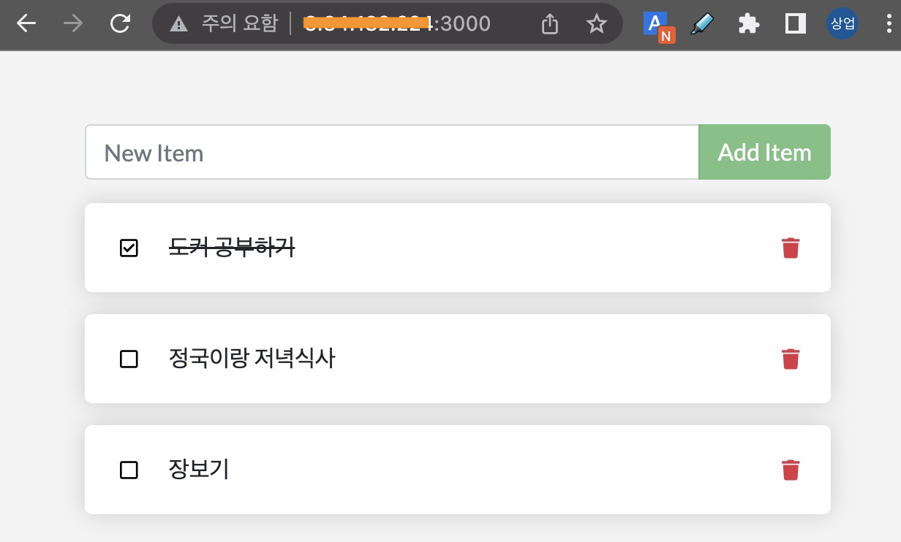

# [Hands-on] 04. Docker network


<br>

# Contents

**[1. Bridge network을 이용하여 Todo app. 실행하기]()**

---

## 1. Bridge network을 이용하여 Todo app. 실행하기

도커 네트워크를 이용해서 아래 그림과 같이 멀티 컨테이너 애플리케이션을 구성해 보겠습니다.
우리 애플리케이션에 Database(MySQL)를 연결해서 서비스하도록 합니다.


먼저 docker network create명령으로 bridge network을 하나 생성하겠습니다.
```bash
ubuntu@ip-10-0-1-14:~$ docker network create todo-app
8440c866efe789d8dac94820c2bbbdca4ca7a6985acff2c3136dd3be31f13203
```


>```bash
>docker network create todo-app
>```

> **명령어** : `docker network create todo-app`  
- 생성된 `network`는 `docker network inspect [OPTIONS] NETWORK [NETWORK...]` 명령어를 이용하여 상세 내용을 확인할 수 있습니다.

---

그리고, 생성한 네트워크를 이용해서 mysql을 실행합니다.
```bash
ubuntu@ip-10-0-1-14:~$ docker run -d \
    --network todo-app --network-alias mysql \
    --volume todo-mysql-data:/var/lib/mysql \
    --env MYSQL_ROOT_PASSWORD=secret \
    --env MYSQL_DATABASE=todos \
    --env LANG=C.UTF-8 \
    --name my-mysql \
    mysql:5.7 \
    --character-set-server=utf8mb4 \
    --collation-server=utf8mb4_unicode_ci
c9d83cbd2ac8941da32d8d64103223fe1c6937c9c28507c6e19ed91fca740c98
```
> **명령어** :
> ```bash
> docker run -d \
>     --network todo-app --network-alias mysql \
>     --volume todo-mysql-data:/var/lib/mysql \
>     --env MYSQL_ROOT_PASSWORD=secret \
>     --env MYSQL_DATABASE=todos \
>     --env LANG=C.UTF-8 \
>     --name my-mysql \
>     mysql:5.7 \
>     --character-set-server=utf8mb4 \
>     --collation-server=utf8mb4_unicode_ci
> ```

이전에 배운 `volume`도 사용하네요.
데이터의 영속성을 위해서 데이터는 `volume`에 저장하도록 구성했습니다.
`docker volume create`명령으로 생성하지 않아도, 없는경우엔 도커가 알아서 생성해줍니다. ◟(ˊᗨˋ)◞ 

---

이제 mysql에 로그인해서 데이터베이스가 잘 생성됐나 봅시다.  
```bash
ubuntu@ip-10-0-1-14:~$ docker exec -it my-mysql mysql -p
Enter password:
Welcome to the MySQL monitor.  Commands end with ; or \g.
Your MySQL connection id is 2
Server version: 5.7.38 MySQL Community Server (GPL)

Copyright (c) 2000, 2022, Oracle and/or its affiliates.

Oracle is a registered trademark of Oracle Corporation and/or its
affiliates. Other names may be trademarks of their respective
owners.

Type 'help;' or '\h' for help. Type '\c' to clear the current input statement.

mysql>
```
> **명령어** :`docker exec -it my-mysql mysql -p`
Password는 `secret` 입니다.  

`mysql>` 프롬프트가 표시되면, 정상적으로 로그인 된겁니다.

---

이제 mysql 명령어로 database를 조회해볼까요?
```bash
mysql> show databases;
+--------------------+
| Database           |
+--------------------+
| information_schema |
| mysql              |
| performance_schema |
| sys                |
| todos              |
+--------------------+
5 rows in set (0.00 sec)
```
> **명령어** :`show databases;`

`todos`라는 database가 보이시나요?  

이제 mysql 에서 나갈게요.
```bash
mysql> exit
Bye
ubuntu@ip-10-0-1-14:~$
```
> **명령어** : `exit`

---

이번에는 우리의 샘플 애플리케이션을 mysql과 연계해서 실행해 보겠습니다.
- Private repository의 이미지를 사용할 경우 로그인(`docker login -u [USER-NAME]`)이 필요합니다.
```bash
ubuntu@ip-10-0-1-14:~$ docker run -dp 3000:3000 \
--network todo-app \
--env MYSQL_HOST=mysql \
--env MYSQL_USER=root \
--env MYSQL_PASSWORD=secret \
--env MYSQL_DB=todos \
--name my-todo-manager \
rogallo/todo-app:1.0.0
e831c21bfbbc9fbb6402c8dc3bbf4b0bd906ab1f0e0ad727f3fad1d37063a0db
```
> **명령어** : 
> ```bash
> docker run -dp 3000:3000 \
>  --network todo-app \
>  --env MYSQL_HOST=mysql \
>  --env MYSQL_USER=root \
>  --env MYSQL_PASSWORD=secret \
>  --env MYSQL_DB=todos \
>  --name my-todo-manager \
> [USER-NAME]/todo-app:1.0.0
> ```  
> [USER-NAME] 에는 여러분의 정보로 채워넣어 주세요.

`--network`옵션으로 mysql과 동일한 네트워크로 설정했고,  
`--env`를 이용해서 mysql 연계에 필요한 환경변수들을 설정해 주었습니다.

---

우리 애플리케이션의 로그를 한 번 볼까요?  
```bash
ubuntu@ip-10-0-1-14:~$ docker logs my-todo-manager
Waiting for mysql:3306.
Connected!
Connected to mysql db at host mysql
Listening on port 3000
```
> **명령어** : `docker logs my-todo-manager`

mysql 과 잘 연결됐다는 로그가 보이시나요?

이제 실행된 애플리케이션에 접속하고 오늘 할 일을 몇 개 적어볼까요?
- AWS EC2인 경우 인스턴스의 Public IPv4 address로 접속하면 됩니다. (e.g. http://IP:3000/)
- Security group의 Inbound rule에 3000번 포트에 대한 규칙이 있어야 합니다.



---

자, 이제 다시 mysql로 로그인해서 table에 잘 저장되어 있나 확인해 보겠습니다.  
```bash
ubuntu@ip-10-0-1-14:~$ docker exec -it my-mysql mysql -p todos
Enter password:
Reading table information for completion of table and column names
You can turn off this feature to get a quicker startup with -A

Welcome to the MySQL monitor.  Commands end with ; or \g.
Your MySQL connection id is 7
Server version: 5.7.38 MySQL Community Server (GPL)

Copyright (c) 2000, 2022, Oracle and/or its affiliates.

Oracle is a registered trademark of Oracle Corporation and/or its
affiliates. Other names may be trademarks of their respective
owners.

Type 'help;' or '\h' for help. Type '\c' to clear the current input statement.

mysql>
```
> **명령어** :`docker exec -it my-mysql mysql -p todos`
Password는 `secret` 입니다.

---

`mysql>`프롬프트가 나오면 아래 쿼리문으로 조회해보세요.

```bash
mysql> select * from todo_items;
+--------------------------------------+---------------------------+-----------+
| id                                   | name                      | completed |
+--------------------------------------+---------------------------+-----------+
| c9f62ed4-a6ff-42bf-b709-7ed3d889f2c6 | 도커 공부하기                 |         1 |
| 32db4ea5-82de-4609-a267-b7b897acb16a | 정국이랑 저녁식사              |         0 |
| 3ce23446-79cc-421a-8c9e-500bd23a4d83 | 장보기                      |         0 |
+--------------------------------------+---------------------------+-----------+
3 rows in set (0.00 sec)
```  
> **명령어** : `select * from todo_items;` 

화면에서 입력한 오늘의 할 일이 todo_items table에 잘 저장되어 있나요?

`exit` 명령으로 나와주시구요.
> **명령어** : `exit`  

여기까지 실습을 마치겠습니다.  ˘◡˘
