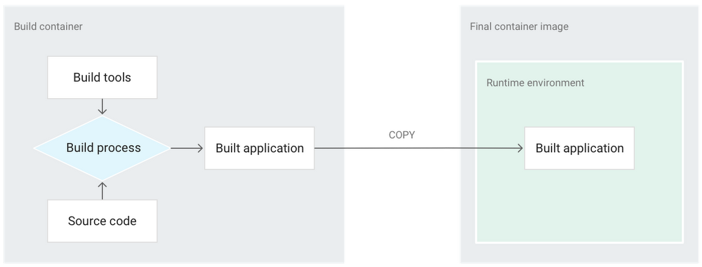

<br>

# Contents

<br>

- **Dockerfile을 이용한 이미지 빌드**
- **Multi-stage build**


---

## Dockerfile을 이용한 이미지 빌드

이번 실습은 Dockerfile을 이용하여 이미지를 생성하는 방법을 알아보겠습니다.
어떻게 하면 좀 더 효율적인 이미지를 만들 수 있는지도 알아볼게요.

<br>

#### Java Application
먼저 간단한 Java 파일(`HelloDocker.java`)을 준비합니다.
```java
public class HelloDocker {
    public static void main(String[] args) {
        System.out.println("Hello Docker!!!");
    }
}
```
<br>

#### Dockerfile
이제 Dockerfile 하나를 준비합니다.
이미지를 만드는 여러가지 방법 중 하나인 Dockerfile을 이용한 빌드를 해볼게요.
```dockerfile
FROM openjdk:8
COPY HelloDocker.java /hello/
WORKDIR /hello
RUN javac HelloDocker.java
CMD ["java","HelloDocker"]
```

---

위에서 만든 Dockerfile을 간단히 설명하자면 다음과 같습니다.
> 1. openjdk8을 Base image로 사용하고
> 2. /hello 경로에 HelloDocker.java 파일을 복사하고
> 3. /hello 경로로 이동한 뒤
> 4. HelloDocker.java 를 컴파일하고
> 5. docker container가 구동되면 `java HelloDocker`를 실행

준비를 마친 상태는 아래와 같습니다.
```bash
ubuntu@ip-10-0-1-14:~$ tree
.
├── Dockerfile
└── HelloDocker.java

0 directories, 2 files
```
> 우리 애플리케이션 소스파일인 `HelloDocker.java` 와 이미지를 만들 때 사용할 `Dockerfile`이 준비됨.

---

#### Docker image 생성
이제 아래 명령어로 hellodocker 이미지를 생성합니다.
```bash
ubuntu@ip-10-0-1-14:~$ docker build -t hellodocker:v1 .
Sending build context to Docker daemon  3.072kB
Step 1/5 : FROM openjdk:8
 ---> 2a8331246713
Step 2/5 : COPY HelloDocker.java /hello/
 ---> 898708a1fb93
Step 3/5 : WORKDIR /hello
 ---> Running in 711b58d64ddb
Removing intermediate container 711b58d64ddb
 ---> f6d8741cd695
Step 4/5 : RUN javac HelloDocker.java
 ---> Running in 6f510b4106f9
Removing intermediate container 6f510b4106f9
 ---> 24ec44b764c2
Step 5/5 : CMD ["java","HelloDocker"]
 ---> Running in 6fdc1dad43f4
Removing intermediate container 6fdc1dad43f4
 ---> d187b50492c2
Successfully built d187b50492c2
Successfully tagged hellodocker:v1
```
> **명령어** : 
> ```bash
> docker build -t hellodocker:v1 .
> ```

---

빌드가 성공하면 `docker images`명령어로 조회도 해보세요.
```bash
ubuntu@ip-10-0-1-14:~$ docker images
REPOSITORY    TAG       IMAGE ID       CREATED         SIZE
hellodocker   v1        d187b50492c2   6 minutes ago   526MB
openjdk       8         2a8331246713   6 days ago      526MB
```
> **명령어** : 
> ```bash
> docker images
> ```

이미지가 준비됐으니 이제 실행을 해볼게요.
```bash
ubuntu@ip-10-0-1-14:~$ docker run hellodocker:v1
Hello Docker!!!
```
> **명령어** : 
> ```bash
> docker run hellodocker:v1
> ```

결과가 예상한 것과 같은가요?

일단 첫 번째 단계는 성공입니다. (ง˙∇˙)ว

---

## Multi-stage build

이전 Step에서 Java Application을 포함하는 docker 이미지를 생성해 보았습니다.  
Base image로 openjdk:8 (JDK)을 사용했기 때문에 이미지의 크기가 큽니다. (앞의 결과는 **526MB**)

docker는 multi-stage build 기능을 제공하기 때문에 최종 docker 이미지에는 binary만 포함될 수 있도록 할 수가 있습니다.

<br>



---

#### Dockerfile 수정
애플리케이션 파일인 HelloDocker.java 파일은 그대로 두고 Dockerfile만 아래와 같이 수정합니다.

```dockerfile
# Build stage
FROM openjdk:8 as build-stage
COPY HelloDocker.java /hello/
WORKDIR /hello
RUN javac HelloDocker.java

# Production stage
FROM openjdk:8-jre as production-stage
COPY --from=build-stage /hello/HelloDocker.class /hello/HelloDocker.class
WORKDIR /hello
CMD ["java","HelloDocker"]
```

| Build stage | Production stage |
| :--- | :--- |
| 1. openjdk8을 build-stage로 정하고<br>2. /hello 경로에 HelloDocker.java파일을 복사<br>3. /hello 경로로 이동<br>4. HelloDocker.java를 컴파일 | 1. openjdk8-jre를 production-stage로 정하고<br>2. /hello/HelloDocker.class 파일 복사 (build -> production)<br>3. 작업 경로를 /hello로 변경<br>4. docker container가 구동되면 `java HelloDocker`를 실행 |

---

#### Docker image 생성
이제 아래 명령어로 hellodocker 이미지 v2를 생성합니다.
```bash
ubuntu@ip-10-0-1-14:~$ docker build -t hellodocker:v2 .
Sending build context to Docker daemon  3.072kB
Step 1/8 : FROM openjdk:8 as build-stage
 ---> 2a8331246713
Step 2/8 : COPY HelloDocker.java /hello/
 ---> Using cache
 ---> 898708a1fb93
Step 3/8 : WORKDIR /hello
 ---> Using cache
 ---> f6d8741cd695
Step 4/8 : RUN javac HelloDocker.java
 ---> Using cache
 ---> 24ec44b764c2
Step 5/8 : FROM openjdk:8-jre as production-stage
 ---> d991802804b7
Step 6/8 : COPY --from=build-stage /hello/HelloDocker.class /hello/HelloDocker.class
 ---> d1ee4db7b623
Step 7/8 : WORKDIR /hello
 ---> Running in 98a5b3f359c0
Removing intermediate container 98a5b3f359c0
 ---> e5eef1dd32d5
Step 8/8 : CMD ["java","HelloDocker"]
 ---> Running in 0c3c772a09dd
Removing intermediate container 0c3c772a09dd
 ---> 61de5a0b96a9
Successfully built 61de5a0b96a9
Successfully tagged hellodocker:v2
```
> **명령어** : `docker build -t hellodocker:v2 .`

---

빌드가 성공하면 `docker images`명령어를 실행해서 결과를 볼까요?
```bash
ubuntu@ip-10-0-1-14:~$ docker images
REPOSITORY    TAG       IMAGE ID       CREATED              SIZE
hellodocker   v2        61de5a0b96a9   About a minute ago   274MB
hellodocker   v1        d187b50492c2   29 minutes ago       526MB
openjdk       8-jre     d991802804b7   6 days ago           274MB
openjdk       8         2a8331246713   6 days ago           526MB
```
> **명령어** : `docker images`

v1 과 v2 는 Java Application은 동일하지만, base image의 차이 때문에 이미지 전체의 사이즈가 크게 차이가 납니다.
- **v1** : 526MB -> **v2** : 274MB   （°o°；）

Cloud native 환경에서는 가능하면 이미지 사이즈를 작게 가져가는게 좋겠죠?

컨테이너 실행결과는 아래처럼 차이가 없습니다.

```bash
ubuntu@ip-10-0-1-14:~$ docker run hellodocker:v2
Hello Docker!!!
```
> **명령어** : `docker run hellodocker:v2`

---

지금까지 실행한 컨테이너들을 모두 삭제하고 마치겠습니다.

```bash
ubuntu@ip-10-0-1-14:~$ docker rm -f $(docker ps -aq)
```
> **명령어** : `docker rm -f $(docker ps -aq)`

<br><br><br>

수고하셨습니다. (〃･ิ‿･ิ)ゞ
