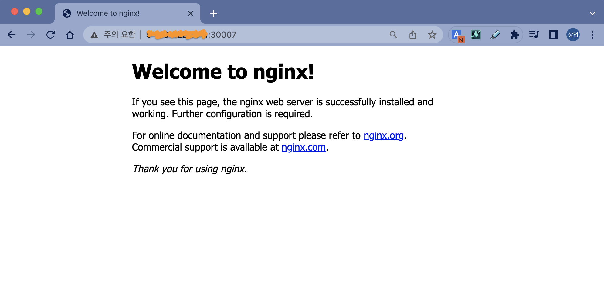
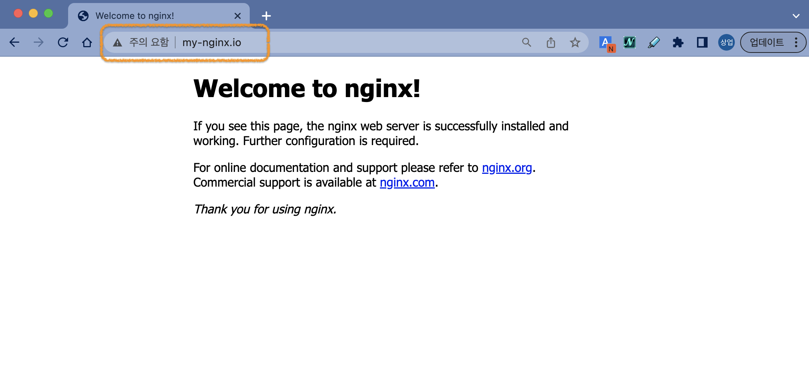

# [Hands-on] 10. Kubernetes Service


<br>

## Contents

**[1. Service를 이용해서 Pod에 연결하기](#1-service를-이용해서-pod에-연결하기)**  
**[2. Ingress를 이용해서 Pod에 연결하기](#2-ingress를-이용해서-pod에-연결하기)**

💾실습파일 위치 : [hands_on_files/ch10](../hands_on_files/ch10)

미리 준비된 실습용 파일을 사용하려는 경우 아래 디렉토리 이동 명령어를 실행해주세요.
```bash
ubuntu@ip-172-31-23-60:~$ cd ~/mspt3/hands_on_files/ch10
ubuntu@ip-172-31-23-60:~/mspt3/hands_on_files/ch10$
```

> 💻 명령어
>```bash
>cd ~/mspt3/hands_on_files/ch10
>```

---

## 1. Service를 이용해서 Pod에 연결하기

이번 실습에서는 **Service**를 이용하는 방법을 알아보겠습니다.  
먼저 **Deployment**를 이용해서 Pod를 몇 개 생성해 보겠습니다.
```yaml
apiVersion: apps/v1
kind: Deployment
metadata:
  name: my-nginx-deployment
  labels:
    app: my-nginx
    tier: frontend
spec:
  replicas: 3
  strategy:
    type: RollingUpdate
  selector:
    matchLabels:
      app: my-nginx
  template:
    metadata:
      labels:
        app: my-nginx
    spec:
      containers:
      - image: nginx:1.19.3
        name: my-nginx
        ports:
        - containerPort: 80
```
> 파일명은 **nginx-deployment.yaml**로 합니다.

<br><br><br>

그리고, 아래와 같이 생성한 다음, 생성된 Pod을 조회합니다.

```bash
ubuntu@ip-172-31-23-60:~$ kubectl apply -f nginx-deployment.yaml
deployment.apps/my-nginx-deployment created
ubuntu@ip-172-31-23-60:~$ kubectl get pods -o wide
NAME                                   READY   STATUS    RESTARTS   AGE   IP           NODE              NOMINATED NODE   READINESS GATES
my-nginx-deployment-55985c7fcf-5qlnp   1/1     Running   0          11s   172.17.0.8   ip-172-31-23-60   <none>           <none>
my-nginx-deployment-55985c7fcf-j96q4   1/1     Running   0          11s   172.17.0.3   ip-172-31-23-60   <none>           <none>
my-nginx-deployment-55985c7fcf-n6lg6   1/1     Running   0          11s   172.17.0.2   ip-172-31-23-60   <none>           <none>
```

> 💻 명령어
>```bash
>kubectl apply -f nginx-deployment.yaml
>```
>```bash
>kubectl get pods -o wide
>```

<br><br><br>

이제 위에서 생성한 Pod들을 사용하는 또다른 Pod를 하나 만들겠습니다.
```bash
ubuntu@ip-172-31-23-60:~$ kubectl run curlpod --image=radial/busyboxplus:curl --command -- /bin/sh -c "while true; do echo hi; sleep 10; done"
pod/curlpod created
```

> 💻 명령어
> ```bash
>kubectl run curlpod --image=radial/busyboxplus:curl --command -- /bin/sh -c "while true; do echo hi; sleep 10; done"
>```

<br><br><br>

그리고,앞에서 만들어진 Nginx Pod의 IP를 이용해서 접속해보겠습니다.
```bash
ubuntu@ip-172-31-23-60:~$ kubectl exec -it curlpod -- curl http://172.17.0.2
<!DOCTYPE html>
<html>
<head>
<title>Welcome to nginx!</title>
<style>
    body {
        width: 35em;
        margin: 0 auto;
        font-family: Tahoma, Verdana, Arial, sans-serif;
    }
</style>
</head>
<body>
<h1>Welcome to nginx!</h1>
<p>If you see this page, the nginx web server is successfully installed and
working. Further configuration is required.</p>

<p>For online documentation and support please refer to
<a href="http://nginx.org/">nginx.org</a>.<br/>
Commercial support is available at
<a href="http://nginx.com/">nginx.com</a>.</p>

<p><em>Thank you for using nginx.</em></p>
</body>
</html>
```

> 💻 명령어
>```bash
>kubectl exec -it curlpod -- curl http://[POD_IP]
>```
>[POD_IP]는 Nginx Pod 중 하나의 IP를 사용하세요.

<br><br><br>

잘 동작하네요.

하지만, 이렇게는 쓰기 어렵습니다.  
Pod의 IP가 어떻게 주어질지 우리는 알 수가 없고, Scaling되는 환경이라면 개별 Pod에 대한 Loadbalancing 문제도 있습니다.

그리고, Cluster IP는 내부에서만 사용되는 IP이기 때문에 클러스터 외부에서 접근이 필요한 경우에는 사용할 수 없습니다.

<br><br><br>

이제 **Service**를 생성해서 위의 문제들을 해결해보겠습니다.  

먼저 **ClusterIP** 타입의 서비스를 하나 만들어 보겠습니다.  
아래와 같은 파일을 준비해주세요.
```yaml
apiVersion: v1
kind: Service
metadata:
  name: nginx-clusterip-service
spec:
  type: ClusterIP
  selector:
    app: my-nginx
  ports:
    - protocol: TCP
      port: 80
      targetPort: 80
```
> 파일명은 **nginx-clusterip-service.yaml**로 합니다.

그리고, 생성합니다.

```bash
ubuntu@ip-172-31-23-60:~$ kubectl apply -f nginx-clusterip-service.yaml
service/nginx-clusterip-service created
```

> 💻 명령어
>```bash
>kubectl apply -f nginx-clusterip-service.yaml
>```

<br><br><br>

생성된걸 조회할 때는 아래와 같이 합니다.
```
ubuntu@ip-172-31-23-60:~$ kubectl get services
NAME                      TYPE        CLUSTER-IP     EXTERNAL-IP   PORT(S)   AGE
kubernetes                ClusterIP   10.96.0.1      <none>        443/TCP   4d11h
nginx-clusterip-service   ClusterIP   10.99.203.15   <none>        80/TCP    25s
```

> 💻 명령어
>```bash
>kubectl get services
>```

**nginx-clusterip-service** 가 우리가 조금 전 생성한 **Service** 리소스 입니다.

<br><br><br>

생성된 Service에는 **CLUSTER-IP**가 있습니다.  
이 아이피로 Pod까지 접근할 수도 있습니다.
```bash
ubuntu@ip-172-31-23-60:~$ kubectl exec -it curlpod -- curl http://10.99.203.15
<!DOCTYPE html>
<html>
<head>
<title>Welcome to nginx!</title>
<style>
    body {
        width: 35em;
        margin: 0 auto;
        font-family: Tahoma, Verdana, Arial, sans-serif;
    }
</style>
</head>
<body>
<h1>Welcome to nginx!</h1>
<p>If you see this page, the nginx web server is successfully installed and
working. Further configuration is required.</p>

<p>For online documentation and support please refer to
<a href="http://nginx.org/">nginx.org</a>.<br/>
Commercial support is available at
<a href="http://nginx.com/">nginx.com</a>.</p>

<p><em>Thank you for using nginx.</em></p>
</body>
</html>
```

> 💻 명령어
>```bash
>kubectl exec -it curlpod -- curl http://[SVC_IP]
>```
> [SVC_IP]는 Service의 CLUSTER-IP를 넣어주세요.

<br><br><br>

**IP**가 아닌 **Name**으로도 가능합니다.  
이렇게요.
```bash
ubuntu@ip-172-31-23-60:~$ kubectl exec -it curlpod -- curl nginx-clusterip-service
<!DOCTYPE html>
<html>
<head>
<title>Welcome to nginx!</title>
<style>
    body {
        width: 35em;
        margin: 0 auto;
        font-family: Tahoma, Verdana, Arial, sans-serif;
    }
</style>
</head>
<body>
<h1>Welcome to nginx!</h1>
<p>If you see this page, the nginx web server is successfully installed and
working. Further configuration is required.</p>

<p>For online documentation and support please refer to
<a href="http://nginx.org/">nginx.org</a>.<br/>
Commercial support is available at
<a href="http://nginx.com/">nginx.com</a>.</p>

<p><em>Thank you for using nginx.</em></p>
</body>
</html>
```

> 💻 명령어
>```bash
>kubectl exec -it curlpod -- curl [SVC_NAME]
>```
>또는
>```bash
>kubectl exec -it curlpod -- curl http://[SVC_NAME]
>```
> [SVC_NAME] 는 Service의 NAME

잘 되네요...  
이제 Service를 만들면 클러스터 내에서는 서비스의 **이름**(**NAME**)으로도 접근이 가능합니다.

<br>

K8s DNS에는 `<service-name>.<namespace-name>.svc.cluster.local`로 등록이 됩니다.  
`<service-name>`만으로 조회가 되는 이유는 [/etc/resolv.conf](https://man7.org/linux/man-pages/man5/resolv.conf.5.html)에 **search 옵션**이 자동으로 주어지기 때문입니다.  
이렇게 확인도 가능합니다.
```bash
ubuntu@ip-172-31-23-60:~$ kubectl exec -it curlpod -- cat /etc/resolv.conf
nameserver 10.96.0.10
search default.svc.cluster.local svc.cluster.local cluster.local ec2.internal
options ndots:5
```

> 💻 명령어
>```bash
>kubectl exec -it curlpod -- cat /etc/resolv.conf
>```

<br><br><br>

이번엔 **NodePort**입니다.  
Node의 특정 Port를 이용하는 방식입니다.

먼저 NodePort 타입의 서비스를 하나 만들어 보겠습니다.
아래와 같은 파일을 준비해주세요.
```yaml
apiVersion: v1
kind: Service
metadata:
  name: nginx-nodeport-service
spec:
  type: NodePort
  selector:
    app: my-nginx
  ports:
    - protocol: TCP
      port: 80
      targetPort: 80
      nodePort: 30007
```
> 파일명은 **nginx-nodeport-service.yaml**로 합니다.

<br><br><br>

그리고, 생성하고 조회까지 해볼게요.
```bash
ubuntu@ip-172-31-23-60:~$ kubectl apply -f nginx-nodeport-service.yaml
service/nginx-nodeport-service created

ubuntu@ip-172-31-23-60:~$ kubectl get services
NAME                      TYPE        CLUSTER-IP      EXTERNAL-IP   PORT(S)        AGE
kubernetes                ClusterIP   10.96.0.1       <none>        443/TCP        4d11h
nginx-clusterip-service   ClusterIP   10.99.203.15    <none>        80/TCP         11m
nginx-nodeport-service    NodePort    10.102.90.119   <none>        80:30007/TCP   7s
```

> 💻 명령어
>```bash
>kubectl apply -f nginx-nodeport-service.yaml
>```
>```bash
>kubectl get services
>```

**ClusterIP**와 **NodePort** 유형의 Service간 차이가 보이시나요? (힌트 : PORT(S))

<br><br><br>

이제는 Node의 IP를 통해서 내부의 Pod로 연결이 가능합니다.  
Node까지의 경로가 열려있다면 어디서든 이 IP로 접근 가능합니다.

웹 브라우저에서 아래와 같이 조회해보세요.



> http://[Node의 IP]:30007 로 접속합니다. (EC2 Instance인 경우 **Public IPv4 address**)

<br><br><br><br><br>

## 2. Ingress를 이용해서 Pod에 연결하기

이번에는 Ingress 리소스를 생성하고 등록된 URL을 이용해서 접속해 보겠습니다.

먼저 Ingress 리소스를 아래와 같이 준비합니다.  
웹 브라우저에서 http://my-nginx.info 와 같이 입력해서 접속해보려고 합니다.

```yaml
apiVersion: networking.k8s.io/v1
kind: Ingress
metadata:
  name: my-nginx-ingress
  annotations:
    nginx.ingress.kubernetes.io/rewrite-target: /$1
spec:
  rules:
    - host: my-nginx.info
      http:
        paths:
          - path: /
            pathType: Prefix
            backend:
              service:
                name: nginx-clusterip-service
                port:
                  number: 80
```
> 파일명은 **nginx-ingress.yaml**로 합니다.

<br><br><br>

이제 Ingress 리소스를 생성합니다.
```bash
ubuntu@ip-172-31-23-60:~$ kubectl apply -f nginx-ingress.yaml
ingress.networking.k8s.io/my-nginx-ingress created
```

> 💻 명령어
>```bash
>kubectl apply -f nginx-ingress.yaml
>```

<br><br><br>

웹 브라우저에서 접속을 하기전에 한 가지 준비할 게 있습니다.

우리가 만든 URL은 DNS에 등록되어 있지 않기 때문에, 접속을 시도해도 어디로 라우팅 되어야하는지 알 수가 없습니다.  
간단히 우리가 접속을 하려고 하는 환경(PC)의 host파일에 다음과 같이 등록해줍니다.  
(웹 브라우저는 DNS 이전에 hosts파일을 먼저 참조합니다.)

- Windows라면 **C:\Windows\System32\drivers\etc\hosts** 파일에,
- Linux계열은 **/etc/hosts** 파일에 추가하면 됩니다.

```bash
#mspt3
11.22.33.44  my-nginx.info
```
> 11.22.33.44 대신 여러분 EC2 Instance의 **Public IPv4 address**를 써주세요.

<br><br><br>

자 이제 정말로 모두 준비가 됐습니다.  
웹 브라우저에서 아래 URL로 접속해보세요.

http://my-nginx.io



잘 되네요. (ง˙∇˙)ว

**nginx-ingress.yaml** 파일의 path부분을 `/` 에서 `/test` 처럼 바꾸면 어떻게 될까요?  
한 번 해보세요.

<br><br><br>

아래와 같이 사용한 리소스들을 정리해주세요.

```bash
ubuntu@ip-10-0-1-161:~$ kubectl delete -f nginx-ingress.yaml
ingress.networking.k8s.io "my-nginx-ingress" deleted
ubuntu@ip-10-0-1-161:~$ kubectl delete -f nginx-nodeport-service.yaml
service "nginx-nodeport-service" deleted
ubuntu@ip-10-0-1-161:~$ kubectl delete -f nginx-clusterip-service.yaml
service "nginx-clusterip-service" deleted
ubuntu@ip-10-0-1-161:~$ kubectl delete -f nginx-deployment.yaml
deployment.apps "my-nginx-deployment" deleted
ubuntu@ip-10-0-1-161:~$ kubectl delete po curlpod
pod "curlpod" deleted
```

> 💻 명령어
>```bash
>kubectl delete -f nginx-ingress.yaml
>kubectl delete -f nginx-nodeport-service.yaml
>kubectl delete -f nginx-clusterip-service.yaml
>kubectl delete -f nginx-deployment.yaml
>kubectl delete po curlpod
>
>```

<br>

정리 후 상태는 아래와 같습니다. (service/kubernetes 는 시스템에서 사용하는 리소스입니다.)
```bash
ubuntu@ip-172-31-23-60:~$ kubectl get ingress
No resources found in default namespace.
ubuntu@ip-172-31-23-60:~$ kubectl get all
NAME                 TYPE        CLUSTER-IP   EXTERNAL-IP   PORT(S)   AGE
service/kubernetes   ClusterIP   10.96.0.1    <none>        443/TCP   7m35s
```

> 💻 명령어
>```bash
>kubectl get ingress
>```
>```bash
>kubectl get all
>```

<br>

끝~
