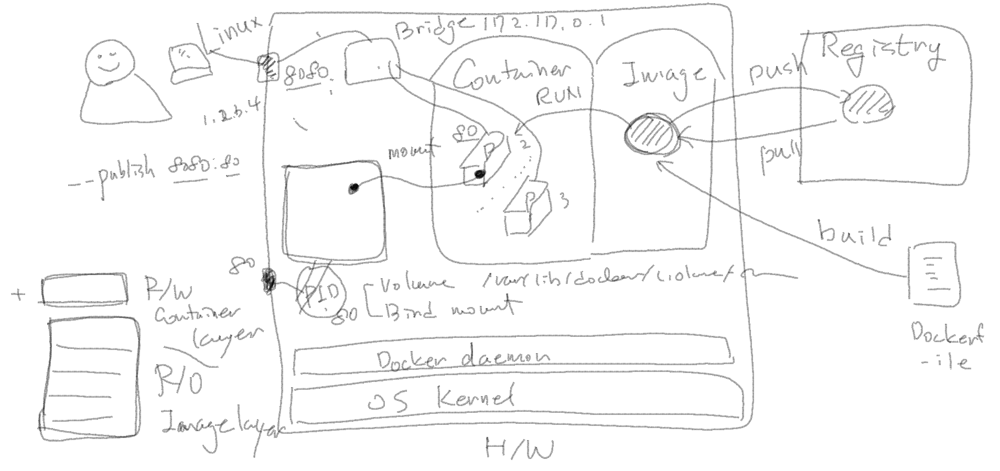

# Docker & Kubernetes 노트 (MSP T2 9차)   (●'◡'●)
## Q&A

### Docker

- docker architecture 그림을 보면 image가 host에 있고, 원본(?)은 registry에 있는 것 같은데 컨테이너를 생성하게 되면 host에 있는 image를 사용하는 건가요?
  - 네, 맞습니다. 컨테이너 생성은 host머신에 있는 image를 이용합니다. host머신에 image가 없으면 registry에서 먼저 pull해서 host머신에 가져온 다음 실행을 합니다.
- 레이어를 구분하는 기준은 무엇인가요? 기능인가요? 레이어를 세팅하면서 기능이든 다른 기준이든 세팅을 할 수 있는건가요?
  - 5장 6장에 dockerfile과 BP를 배울텐데요, 그때 자세히 다루어집니다. 조금만 참아주세요~ ^^
- Github로 비유하자면 dockerfile은 개발코드, image는 feature brench, docker registry는 github의 branch(운영/개발/qa)같은거라고 보면 될까요? devops로 각 서버로 빌드하는게 container run개념과 비슷해보여서요.
  - Github의 브랜치와 비유하기는 좀... 어렵네요. -_-;
  - 수업중에 DevOps 과정을 한 번 설명드리겠습니다. (컨테이너인 경우 어떻게 DevOps, CI/CD를 하는지)
- windows에 ubuntu를 설치한 후 Docker Desktop을 통해 Docker를 설치해야 하는데요, Ubuntu에 apt로 설치하는 것과 차이가 있는지 궁금합니다.
  - 둘 다 docker architecture( cli, daemon )를 이용하는데, Docker desktop은 CLI뿐만 아니라 GUI를 가진 형태이고 kubernetes까지 손쉽게 학습환경을 만들 수 있다는 장점이 있습니다.
  - apt로 설치하시는 방법은 교재로 보자면 docker engine을 설치하는 것입니다. (cli로 daemon과 통신하면서 실행하는 방식)

---

- docker pull nginx 했을 때 registry는 어디에 있는건가요? 도커 설치 시 registry가 같이 설치되는건가요?
  - default registry는 hub.docker.com을 이용합니다.
  - registry는 같이 설치되지는 않고, 필요하면 설치해서 쓸 수도 있습니다.
  - hub.docker.com이 아닌 다른 registry를 쓰려면, `docker login OOO` 명령어로 다른 registry에 로그인 한 후 pull/push명령어를 실행하면 됩니다.
- SCP의 Container registry는 Private만 있는건가요?
  - ...
- Docker registry와 repository는 단순 용어차이인가요?
  - registry는 저장소 그 자체이고, repository는 저장소 내에서 구분된 저장공간 입니다.
- 사용자별로 명령어에 대한 권한을 차등적으로 줘서 어떤 명령어는 수행이 안되게 하는 기능이 있나요? (e.g. rm을 하지 못하게...)
  - ...
- 리눅스 명령 중 screen도 docker와 유사한 것으로 이해되는데, 일종의 리눅스 docker로 봐도 되나요?
  - ...
- `docker ps` 명령으로 아무것도 안보이는데, `docker ps -al` 령으로는 보입니다. 어떤 차이가 있나요?
  - running 중인것을 보는것과, 전체(running + exited)를 보는것의 차이입니다.
  - `-a`옵션이 전체를 보는 옵션입니다.
- `exit`를 했을 때 컨테이너가 종료되지 않도록 하거나 자동 재시작하도록 하는 방법이 있나요?
  - `exit`는 종료(stop), `ctrl+p,q`는 종료하지 않고 빠져나오기 입니다.
  - 아래 box1은 exit로 나온 경우이고(container가 stop된 상태), box2는 ctrl+p,q로 나온 경우(container가 여전히 running상태)입니다.
```bash
ubuntu@ip-10-0-1-205:~$ docker run -it --name box1 busybox sh
/ # exit
ubuntu@ip-10-0-1-205:~$ docker run -it --name box2 busybox sh
/ # ubuntu@ip-10-0-1-205:~$
ubuntu@ip-10-0-1-205:~$ docker ps -a
CONTAINER ID   IMAGE     COMMAND   CREATED          STATUS                      PORTS     NAMES
99afe3cc6025   busybox   "sh"      8 seconds ago    Up 7 seconds                          box2
508b37c96942   busybox   "sh"      28 seconds ago   Exited (0) 25 seconds ago             box1
```

- `docker stop`과 `docker rm`은 어떤 차이인가요?
  - stop은 컨테이너를 중단한 것이고(삭제된것은 아님.) 다시 start할 수 있습니다.
  - rm 은 컨테이너를 삭제한 것이고, 다시 만들려면 run 명령을 이용해야 합니다.

---

- Volume, Bind mount 사용 시 컨테이너에서 발생된 I/O가 ReadWrite Layer를 거치지 않나요?
  - Storage driver를 거치지 않고, 마운트된 host machine의 디스크로 직접 I/O가 됩니다.

---

- overlay network도 설명 부탁드립니다.
  - ...

- 브릿지의 포트번호는 표기가 안되나요?
  - 브릿지는 특별히 포트를 가진 개체는 아니라 표시가 되지는 않습니다.
  - 포트정보는 호스트와 컨테이너를 연결할 정보 (e.g. 8080:80 -> 호스트의 8080:컨테이너의 80)를 가지고 연결되고, 브릿지는 말 그대로 그 중간에 연결역할을 합니다.

- 실습에서 layer가 훨씬 많아졌는데, mysql, n/w이 추가되어서 그런건가요?
  - 그런것은 아닙니다.
  - 기본적으로 실행되는 이미지는 동일한 todo-app을 사용하기 때문에 동일한 레이어를 가지고 있습니다.
  - mysql, n/w은 이미지를 이용해서 실행할 때 추가적으로 구성하는 요소들 입니다.


---

- dockerfile에 CMD가 여러 개 있을 때 RUN 시점에 파라미터를 주면 어떤 CMD에 적용이 되나요?
  - 마지막 CMD에 적용이 됩니다.
```bash
ubuntu@ip-10-0-1-205:~/temp$ cat Dockerfile
FROM centos
ENTRYPOINT ["/bin/echo", "Hello docker"]
CMD ["world1"]
CMD ["world2"]
CMD ["world3"]
ubuntu@ip-10-0-1-205:~/temp$ docker run --rm my-ubuntu:v3
Hello docker world3
ubuntu@ip-10-0-1-205:~/temp$ docker run --rm my-ubuntu:v3 aaa
Hello docker aaa
ubuntu@ip-10-0-1-205:~/temp$ docker run --rm my-ubuntu:v3 aaa bbb
Hello docker aaa bbb
```
- `COPY . .`을 하지 않으면 이미지가 container로 실행될 때 파일이 없나요? 기본으로 해줘야 하는건지 궁금합니다.
  - 네, 맞습니다. 컨테이너가 동작하는동안 필요한 파일은 dockerfile에서 COPY와 같은 instruction을 이용해서 복사해줘야 합니다.
  - 또는 실행한 후에 뭔가 파일을 컨테이너 내부로 복사하려면 `docker cp` 라는 명령을 쓸 수도 있습니다.
- 

---

- Registry의 이미지가 변경이 일어나면, 호스트에 있는 기존 이미지로 생성된 컨테이너들은 언제 반영이 되는지요? 절차가 따로 있나요?
  - 변경이 있다는 것을 새로운 tag가 만들어졌다는 것으로 본다면, 그 새로운 tag로 컨테이너를 다시 실행해야 됩니다.
  - 그런 과정들을 CI/CD파이프라인에 반영해서 하게 됩니다.
- Bridge 네트워크는 L2역할만 하나요? L4 역할은 불가능한가요?
  - L2만 한다고 합니다. (저도 잘 모르던 분야인데, 이번에 알았습니다. m_ _m )
  - [4. Docker 네트워크 (리눅스 용)](https://doitnow-man.tistory.com/m/183) 
- Dockerfile_BP에서 leverage build cache는 기본 설정으로 캐시에서 layer를 찾아 재사용하는게 효율적이라는 건가요?
  - ...

#### Docker summary


### Kubernetes

- K8S Object가 볼륨+컨테이너+N/W를 묶은 하나의 Object가 되는건지, 아니면 각각 개별 Object가 되는건지 궁금해요.
  - 각각이 Object로 만들어 집니다.
  - 그래서 하나의 Application이 완전한 구성을 가지려면 여러 Object들을 이용해야 하고, 그런 것들을 편리하게 패키지로 관리하기 위해서 helm(15장)을 사용합니다.

---

- 하나의 Cluster에서 수용 가능한 Node수는 어느정도 인가요?
  - Kubernetes 1.25에서는 5,000개 까지 가능하다고 합니다.  （°o°；）
  - [대형 클러스터에 대한 고려 사항](https://kubernetes.io/ko/docs/setup/best-practices/cluster-large/) 를 참고하세요.
