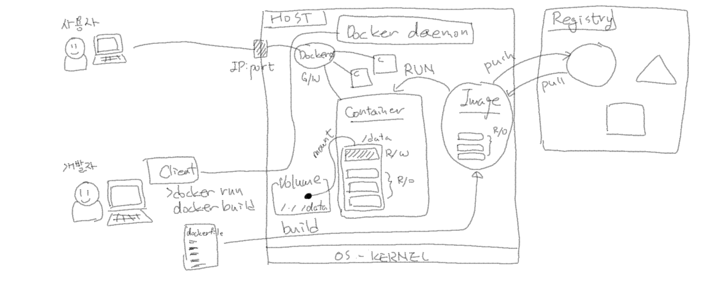

# MSP T3 - 23-4차


## Docker

- VM의 경우는 각 OS별로 스토리지를 할당받아서 용량이 넘지않게 사용할 수 있도록 관리가 가능한데, 컨테이너도 동일한가요?
  - 네, 가능합니다.
  - Storage 옵션은 [docker run](https://docs.docker.com/engine/reference/commandline/run/) 명령어의 `--storage-opt`옵션을 사용하면 되고, 자세한 내용은 [Set storage driver options per container (--storage-opt)](https://docs.docker.com/engine/reference/commandline/run/#storage-opt)를 참고하시면 됩니다.
  - Storage 외에도 CPU나 Memory에 대한 옵션도 있으니 참고하세요.

- os kernel이 다르면 동일한 이미지를 사용할 수 없나요? (linux, bsd, ...)
  - 네, 맞습니다. 컨테이너는 결국 os kernel의 시스템명령어들을 사용해야 하기 때문에, 커널에 맞는 이미지가 만들어지고 사용되게 됩니다. 

### Docker Summary


---

## Kubernetes

- Pod lifecycle에서 Unknown은 비정상 상태일텐데, success로 끝날수도 있나요?
  - ...

- minikube 실습환경에서 pod로 생성된 컨테이너를 docker 명령어로 삭제(rm)하면 어떻게 되나요?
  - 수업시간에 같이 확인해 봤습니다.
  - k8s object인 pod에 의해서 생성된 컨테이너를 rm 한 것이기 때문에, pod object는 그대로 있고 container만 재시작 된 걸로 확인됩니다. (아래 예시 참고하세요)
```bash
ubuntu@ip-172-31-27-225:~$ kubectl get pods my-nginx1
NAME        READY   STATUS    RESTARTS   AGE
my-nginx1   1/1     Running   2          38m
ubuntu@ip-172-31-27-225:~$ docker ps | grep my-nginx1
3b1c19cd926f   f35646e83998                               "/docker-entrypoint.…"   7 minutes ago    Up 7 minutes                                                                               k8s_my-nginx1_my-nginx1_default_3e203f9d-2716-4e70-b1d8-c0a68668d038_2
c2241247ae26   k8s.gcr.io/pause:3.6                       "/pause"                 38 minutes ago   Up 38 minutes                                                                              k8s_POD_my-nginx1_default_3e203f9d-2716-4e70-b1d8-c0a68668d038_0
ubuntu@ip-172-31-27-225:~$ docker rm -f 3b1c19cd926f
3b1c19cd926f
ubuntu@ip-172-31-27-225:~$ kubectl get pods my-nginx1
NAME        READY   STATUS    RESTARTS   AGE
my-nginx1   1/1     Running   3          38m
```


- 실행된 pod의 ip가 172.17.0.0/16를 갖는 것 같은데, 이것도 런타임이 docker여서 그런건가요?
  - 아래 그림과 같이 정해진 PodCIDR 범위 내에서 Pod ip가 주어집니다. (아래는 192.168.1.0/24 에서 192.168.1.3 로 주어진 예시)
  - 우리 실습환경인 minikube는 위와 다른 상태입니다. 정해진 PodCIDR이 아닌, Docker bridge의 subnet인 172.17.0.0/16 에서 ip가 주어진 것으로 보이며, 이 부분은 더 확인하고 아래에 내용을 업데이트 해 놓겠습니다.

```bash
controlplane $ kubectl get nodes          
NAME           STATUS   ROLES           AGE   VERSION
controlplane   Ready    control-plane   14d   v1.26.1
node01         Ready    <none>          14d   v1.26.1
controlplane $ kubectl describe nodes node01 | grep -i podcidr
PodCIDR:                      192.168.1.0/24
PodCIDRs:                     192.168.1.0/24
controlplane $ kubectl get pods -o wide
NAME       READY   STATUS    RESTARTS   AGE     IP            NODE     NOMINATED NODE   READINESS GATES
my-nginx   1/1     Running   0          6m16s   192.168.1.3   node01   <none>           <none>
```
> 일반적인 경우 위와같이 PodCIDR 범위내의 IP가 주어집니다. (killercoda에서 확인해보세요)

```
ubuntu@ip-172-31-27-225:~$ kubectl describe node ip-172-31-27-225 | grep -i podcidr
PodCIDR:                      10.244.0.0/24
PodCIDRs:                     10.244.0.0/24
ubuntu@ip-172-31-27-225:~$ kubectl get pod -o wide
NAME       READY   STATUS    RESTARTS   AGE   IP           NODE               NOMINATED NODE   READINESS GATES
my-nginx   1/1     Running   0          12m   172.17.0.2   ip-172-31-27-225   <none>           <none>
ubuntu@ip-172-31-27-225:~$ docker network inspect bridge | grep -i subnet
                    "Subnet": "172.17.0.0/16",
```
> 이건 minikube 실습환경에서 확인한 결과입니다. PodCIDR (10.244.0.0/24)과 다른 IP가 Pod에 주어져 있습니다.
