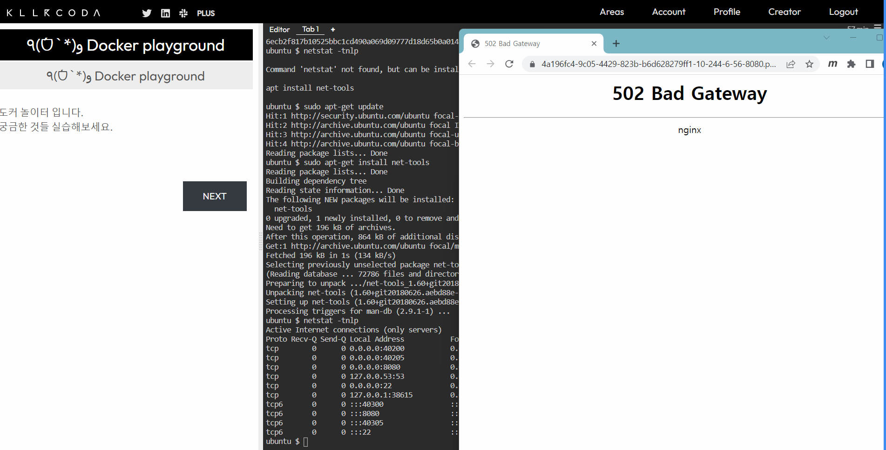

# MSP T3 - 23-5차


## Docker

- 컨테이너 환경은 OS가 24시간 동작한다고 생각하면 되겠네요.
  - 네, 맞습니다. provisioning 측면에서 보자면 VM은 OS를 부팅하는 것 부터 시작하고, 컨테이너는 OS가 실행되어 있는 상태에서 컨테이너(프로세스)가 실행된다고 보시면 됩니다.

- 컨테이너 레이어에서 어떤 파일을 사용할지 결정할 때 상위에 있는 Image layer 순서는 어떻게 정해지나요?
  - 뒤에서 배우겠지만, 이미지를 만들 때 쓰이는 Dockerfile의 명령어 순서에 따라서 레이어가 생성됩니다.
  - 먼저 실행된 명령어(Instruction)가 하위 레이어가 되고, 나중에 실행된 명령어가 상위 레이어가 됩니다.
  - 동일한 파일이 여러 레이어에 있다면, 최종 파일시스템은 상위 레이어의 것이 우선 사용됩니다.

- 이미지와 컨테이너는 상호 종속관계가 아니고 독립적인 관계인가요?
  - 이미지는 컨테이너를 생성하기 위한 패키징된 파일시스템이라고 보시면 됩니다.
  - 컨테이너가 생성되면 이미지의 파일시스템 레이어들과, 컨테이너의 레이어가 합쳐져서 하나의 파일시스템이 되기 때문에 완전히 독립적이라고 보기는 어렵습니다.
  - 하지만, 결국에는 각각의 컨테이너는 격리된 자신만의 공간(namespace)을 가지기 때문에 독립적인 것 처럼 동작합니다. (PID, Network, MNT등이 모두 자신만의 공간을 가진 것 처럼 동작합니다.)

- 다른 사람이 만든 이미지에 push를 통해서 덮어 씌울 수 있나요?

- 이미지로부터 컨테이너를 run하여 생성한 후, 그 이미지를 삭제(?)하면 run하던 컨테이너는 어떻게 되나요?
  - 먼저 docker 명령어를 이용한 이미지 삭제(`docker rmi`)는 안됩니다. (아래 참조. -> 에러가 발생함.)
  - 강제로 이미지 레이어의 파일(/var/lib/docker/overlay2/.... 에 있는)을 root권한으로 삭제할 수는 있지만, 문제가 될 수 있습니다.

```bash
ubuntu $ docker run -d nginx
Unable to find image 'nginx:latest' locally
latest: Pulling from library/nginx
f03b40093957: Pull complete 
eed12bbd6494: Pull complete 
fa7eb8c8eee8: Pull complete 
7ff3b2b12318: Pull complete 
0f67c7de5f2c: Pull complete 
831f51541d38: Pull complete 
Digest: sha256:af296b188c7b7df99ba960ca614439c99cb7cf252ed7bbc23e90cfda59092305
Status: Downloaded newer image for nginx:latest
54767f04cfab7b1d557fffb565a43802e96d9c9c11acd5d63dc4f8e1353ba49b
ubuntu $ docker ps
CONTAINER ID   IMAGE     COMMAND                  CREATED         STATUS         PORTS     NAMES
54767f04cfab   nginx     "/docker-entrypoint.…"   5 seconds ago   Up 4 seconds   80/tcp    compassionate_mcnulty
ubuntu $ docker images
REPOSITORY   TAG       IMAGE ID       CREATED       SIZE
nginx        latest    f9c14fe76d50   2 weeks ago   143MB
busybox      latest    8135583d97fe   2 weeks ago   4.86MB
ubuntu $ docker rmi nginx
Error response from daemon: conflict: unable to remove repository reference "nginx" (must force) - container 54767f04cfab is using its referenced image f9c14fe76d50
```

- commit을 하게되면 image에 변경되어 저장되나요?
  - 맞습니다. container layer에 기록된 내용이 새로운 layer가 되어 (레이어가 하나 더 더해져서), 새로운 이미지가 만들어집니다.
  - 보통, 기존의 이미지에 어떤 작업을 한 다음 그 내용을 포함한 새로운 이미지를 만들 때 사용됩니다.

- run하는 동안에는 images와 컨테이너는 연결되어 있는건가요?
  - 네, 맞습니다.
  - 이미지 레이어(R/O layer)들과 컨테이너 레이너(R/W layer)가 합쳐진(Union) 파일시스템이 그 컨테이너(run된 컨테이너)의 파일시스템이 됩니다.

- test 라는 파일은 R/W 레이어에 있는건가요? (* test파일은 컨테이너 실행 후 생성된 파일)
  - 네, 맞습니다.
  - 실행된 컨테이너에서 생성/수정/삭제되는 모든것은 R/W레이어에 기록됩니다.

- digest는 뭔가요?
  - ...

- pull때 기본 디렉토리는 library/ 이고, push때 기본 디렉토리는 docker.io/ 인가요?
  - 아니오. 교재는 그냥 예시를 보여주기 위해서 몇 가지 샘플을 표시한 것입니다.
  - 고유한 repository를 앞에 표시하는데, 뒤에 더 자세히 다룰 예정입니다.

- `docker run`을 실행하면 `docker pull`은 같이 수행되나요?
  - 네, 맞습니다.
  - 고맙게도, 현재 host machine에 run하기 위해 필요한 이미지가 없으면 알아서 pull까지 해줍니다.
  - 명시적으로 `docker pull`하고 `docker run`해도 됩니다.

- 이미지는 push시에 다른 버젼으로 자동으로 생성해 주는 건가요?
  - 아니오, 그렇지는 않습니다.
  - 이미지를 push하기 전에, host machine에서 tag(버젼)까지 붙여서 만들어 줘야합니다. 그리고, 나서 그 이미지:태그 를 push 합니다.

- Chapter2 교재 4페이지에서 `docker push` 시에 3개는 push, 4내는 이미 존재하는 레이어라고 나오는데요, r/w레이어는 하나인데 왜 3개가 push되나요?
  - `docker push`명령어는 host머신에 있는 이미지를 registry로 업로드(push)하는 것입니다.
  - 교재의 경우 7개의 레이어로 이루어진 todo-app:1.0.0이라는 이미지를 push 하는 것이며, 이 때는 컨테이너 레이어(R/W layer)는 포함되어 있지 않습니다.
  - push되는 3개와, 이미있는 4개의 차이는 registry에 이미 있는 레이어라면 push 하지 않아도 되기때문에 생략되는 것입니다. (새롭게 만들어진 레이어만 push됩니다.)

- R/W 레이어를 마운트하지 않고 커밋으로 이미지화 하면 동일하게 삭제되지 않고 사용할 수 있지 않나요?
  - 네, 파일을 저장하는 용도로만 접근한다면 그런 방법도 가능은 합니다.
  - 하지만, 커밋하는 것은 새로운 이미지를 만든다는 것입니다.
  - 동일한 이미지를 이용해서 여러개의 컨테이너를 실행하는 것이 기본적인 사용 유형인데, 이때 데이터를 처리하는 방법이 마운트(볼룸)를 하는 것입니다.

- Docker network의 bridge유형이 L4랑 비슷한 개념일까요?
  - L2 통신을 지원합니다.
  - [4. Docker 네트워크 (리눅스 용)](https://doitnow-man.tistory.com/m/183) 의 내용도 참고하세요.

- host유형으로 쿠버네티스에서 사용하나요?
  - 쿠버네티스도 기본은 bridge 네트워크를 사용합니다.

- Host 유형은 잘 사용하지 않나요? 어떨 때 사용하나요?
  - host머신의 네트워크를 직접 사용해야 할 때 사용됩니다.
  - [Host network driver](https://docs.docker.com/network/drivers/host/) 의 내용 참조하시면 좋을 것 같습니다. (아래 내용)
  - "Host mode networking can be useful to optimize performance, and in situations where a container needs to handle a large range of ports, as it does not require network address translation (NAT), and no “userland-proxy” is created for each port."

- 볼륨을 사용하지 않으면 mysql 에 저장된 데이터도 삭제되나요?
  - 네, 맞습니다.
  - 모든 컨테이너는 컨테이너레이어(R/W 레이어)에 저장하는 내용은 컨테이너가 삭제되면 함께 삭제됩니다.
  - mysql도 volume을 사용해서 데이터 디렉토리를 외부로 마운트해야 데이터를 유지할 수 있습니다.

- EXPOSE는 80으로 설정하고 docker run -p 8080:8080 로 하면 어떻게 되나요?
  - 이렇게 되네요. 502 Bad gateway ^^;  ( EXPOSE 80으로 만들어진 nginx를 8080으로 실행 )

```
ubuntu $ docker run -dp 8080:8080 nginx
Unable to find image 'nginx:latest' locally
latest: Pulling from library/nginx
f03b40093957: Pull complete 
eed12bbd6494: Pull complete 
fa7eb8c8eee8: Pull complete 
7ff3b2b12318: Pull complete 
0f67c7de5f2c: Pull complete 
831f51541d38: Pull complete 
Digest: sha256:af296b188c7b7df99ba960ca614439c99cb7cf252ed7bbc23e90cfda59092305
Status: Downloaded newer image for nginx:latest
6ecb2f817b10525bbc1cd490a069d09777d18d65b0a01438955f912719ec6258
ubuntu $ netstat -tnlp
Active Internet connections (only servers)
Proto Recv-Q Send-Q Local Address           Foreign Address         State       PID/Program name    
tcp        0      0 0.0.0.0:40200           0.0.0.0:*               LISTEN      21950/kc-terminal   
tcp        0      0 0.0.0.0:40205           0.0.0.0:*               LISTEN      21937/node          
tcp        0      0 0.0.0.0:8080            0.0.0.0:*               LISTEN      22870/docker-proxy  
tcp        0      0 127.0.0.53:53           0.0.0.0:*               LISTEN      22163/systemd-resol 
tcp        0      0 0.0.0.0:22              0.0.0.0:*               LISTEN      604/sshd: /usr/sbin 
tcp        0      0 127.0.0.1:38615         0.0.0.0:*               LISTEN      13907/containerd    
tcp6       0      0 :::40300                :::*                    LISTEN      22135/runtime-scena 
tcp6       0      0 :::8080                 :::*                    LISTEN      22875/docker-proxy  
tcp6       0      0 :::40305                :::*                    LISTEN      22307/runtime-info- 
tcp6       0      0 :::22                   :::*                    LISTEN      604/sshd: /usr/sbin 
```



- COPY는 storage(volume, bind mount 등)와는 어떤 관련이 있나요?

- 

---

## Kubernetes
