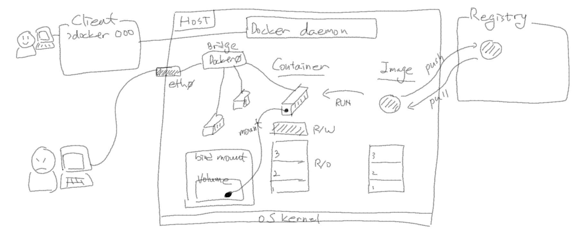

# MSP T3 - 23-6차


## Docker

- 'exit' 명령어를 실행하면 run 했던 container도 중지(stop) 되는 건가요?
  - 네, 맞습니다.
  - 중지하지 않고 exit하는 방법도 있습니다. ( ctrl + p, q )
  - [docker attach](https://docs.docker.com/engine/reference/commandline/attach/#description) 의 문서도 참고하세요.
 
- Volume을 구성하게 되면 Container layer (R/W layer)는 생성만 할 뿐인가요?
  - Volume을 구성할 때 컨테이너의 파일시스템 중 특정 디렉토리를 volume에 마운트하게 됩니다.
  - Container layer는 volume으로 마운트된 디렉토리 외에도 모든 파일시스템에 대한 File 처리가 되기 때문에 생성만 하고 사용되지 않는 건 아닙니다.
    
- RUN instruction의 내용은 image안에 들어가고, CMD instruction의 내용은 image안에 안들어가다 인거죠?
  - 네, 맞습니다.
  - RUN 에 의해 수행된 내용은 하나의 layer가 되어 image에 포함됩니다.
  - CMD 의 내용은 layer에는 포함되지 않고, 컨테이너가 생성되는 시점에 실행됩니다.

- RUN은 container를 실행시키는데 필요한 부분, CMD는 container의 app. 등의 실행에 필요한 부분이라고 이해하면 될까요?
  - 위 질문의 답변을 참고해주세요.

- `--publish-all`로 EXPOSE로 지정된 모든 포트를 오픈하는 경우 host의 포트와 expose에 등록된 포트는 어떻게 매핑되나요? (e.g. expose에 복수의 포트가 등록된 경우)
  - `publish-all`은 host의 포트에 랜덤하게 연결됩니다.
  - 복수개의 포트가 있어도 모두 랜덤하게 연결됩니다.
  - [docker run](https://docs.docker.com/engine/reference/commandline/run/) 문서의 `--publish-all` 부분 참고하세요.

- EXPOSE나 VOLUME이 dockerfile에 작성되지 않은 경우 포트오픈이나 볼륨 마운트는 불가능한가요?
  - 먼저 EXPOSE에 지정한 포트는 같은 네트워크 안에는 모두 노출됩니다. (같은 브릿지 아래있는 다른 컨테이너에서 EXPOSE로 지정한 포트로 접근 가능.)
  - 여기서 더 나가서 --publish 옵션을 이용하여 Host으 포트로 연결됩니다.
  - 만약, Dockerfile에서 EXPOSE 로 지정하지 않은 포트를 `docker run` 시점에 노출시키면 아래와 같이 연결됩니다.
```bash
ubuntu@ip-172-31-27-160:~$ docker run -d --name my-nginx -p 8080:80 -p 8081:81 nginx
172eb72f5cb5987ba7a6acf83abe4349fedbea8aa65c856d3b570b2a97ef0b24
ubuntu@ip-172-31-27-160:~$ docker inspect my-nginx
[

... 생략 ...

        "NetworkSettings": {
            "Bridge": "",
            "SandboxID": "060131501ffb9ddca11ea92882db9d74f44ea4e0beceb595397534219410b511",
            "HairpinMode": false,
            "LinkLocalIPv6Address": "",
            "LinkLocalIPv6PrefixLen": 0,
            "Ports": {
                "80/tcp": [
                    {
                        "HostIp": "0.0.0.0",
                        "HostPort": "8080"
                    },
                    {
                        "HostIp": "::",
                        "HostPort": "8080"
                    }
                ],
                "81/tcp": [
                    {
                        "HostIp": "0.0.0.0",
                        "HostPort": "8081"
                    },
                    {
                        "HostIp": "::",
                        "HostPort": "8081"
                    }
                ]
            },

... 생략 ...

```

- CMD같이 명령어가 여러개 있는 경우 layer는 어떻게 되나요?
  - CMD, ENTRYPOINT는 컨테이너 실행시점에 수행되는 명령어를 지정하는 Instruction이고 layer에 포함되지 않습니다.

    
- Multi-stage build에서 원하는 위치까지만 실행할 수도 있나요? (e.g. build 시점에 첫 번째 stage만 진행)
  - 네, 가능합니다. 특정 stage를 target으로 지정해서, 거기까지만 실행되도록 할 수 있습니다.
  - [Stop at a specific build stage](https://docs.docker.com/build/building/multi-stage/#stop-at-a-specific-build-stage) 의 내용 참고하세요.

- Hands-on 05. single과 multi 수행한 이후 각각의 image inpsect을 하면 layer구성의 차이가 있습니다. multi의 경우 layer 수가 single보다 작게 구성되어 있음을 확인할 수 있어요. 사이즈와 연관이 있다고 봐야하는 걸까요? layer 수가 작게 구성되는 이유가 궁금합니다.
  - ...  

- Hands-on 05 의 실습에서 Dockerfile2는 Dockerfile1의 내용을 포함하고, 추가로 jre/app실행하는데 왜 파일사이즈가 더 작은지 설명해주세요.
  - ...

### Docker Summary
 

---

## Kubernetes

- YAML파일에서 `-`가 있는 경우와 없는 경우는 무슨 차이인가요?
  - Parent-Child 관계에서 Child가 복수인 경우 Child의 시작위치에 `-`를 붙여서 사용합니다.

- pod 가 노드에 스케줄되나요? container 가 스케줄되나요? pod 에 여러 개의 container 가 있으면, container 들이 서로다른 노드에 스케줄 될수도 있나요?
 - 엄밀히 말하자면 컨테이너가 스케쥴되는게 맞지만, pod는 컨테이너와 직접 연관이 있는 k8s 오브젝트이기 때문에 pod가 스케쥴된다고 해도 크게 틀린표현은 아닙니다.
 - 여러개 컨테이너가 있어도 같은 pod에 속하는 것이라면 같은 노드에 배치됩니다.

- Container probe의 설정 필드들의 단위는 초(seconds) 인가요?
  - 네, 맞습니다. 예를들어 `periodSeconds`는 probe를 실행하는 주기를 초단위로 설정한 것입니다.
 
- Replica를 5 -> 3으로 조정해서 줄이는 경우 조정대상에 대한 규칙이 있나요? 이에 대해서도 정할수가 있나요?
  - ...
 
- [Hands-on] 09. Kubernetes Workload(2)  에서 replicaset 삭제하지 않고, deployment를 생성한 경우 pod 생성.....
